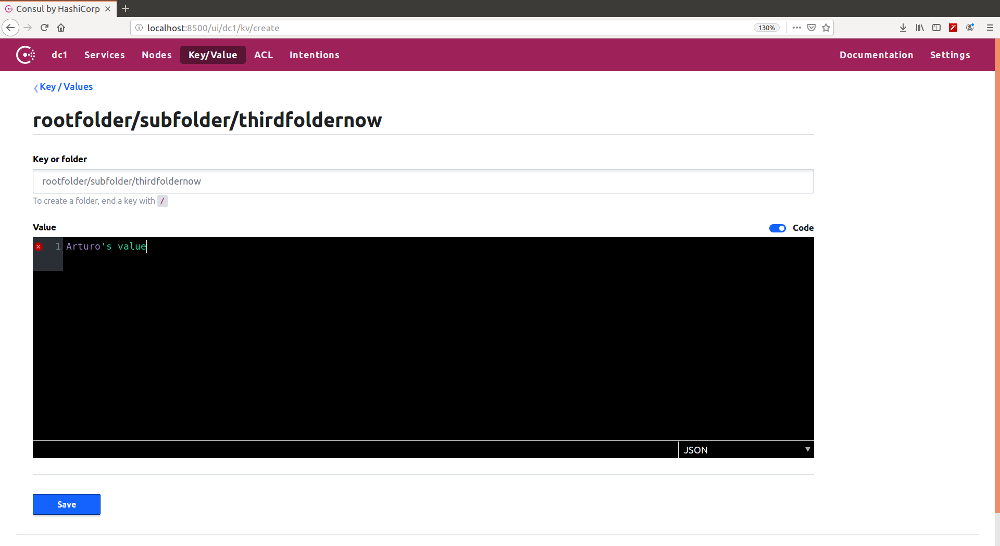

# Microservice configuration

#### Table Of Contents
1. [Document objective](#1-document-objective)
2. [Run Consul](#2-run-consul)
3. [Create configuration values using Consul UI and REST API](#3-create-configuration-values-using-consul-ui-and-rest-api)
4. [Retrieve configuration values using Consul UI and REST API](#4-retrieve-configuration-values-using-consul-ui-and-rest-api)

## 1 Document objective

In this block we are going to:
 
* Configure our microservices with Kubernetes only
* Use Consul as a central configuration server
* Perform Service Lookup in a client using Consul  

## 2 Run Consul

Start Consul:

```
arturotarin@QOSMIO-X70B:~/go/src/github.com/ArturoTarinVillaescusa/go_cloud_orchestration/go_microservice_frameworks/microservice_configuration
19:27:37 $ docker-compose up -d consul
Starting microserviceconfiguration_consul_1 ... done
```

## 3 Create configuration values using Consul UI and REST API

Opening a browser and navigating to my Consul UI where the Key/values can be manually created and retrieved:



## 4 Retrieve configuration values using Consul UI and REST API

We can retrieve them using the command line:

```
arturotarin@QOSMIO-X70B:~/go/src/github.com/ArturoTarinVillaescusa/go_cloud_orchestration/go_microservice_frameworks/microservice_configuration
21:31:13 $ docker exec -it microserviceconfiguration_consul_1 sh
/ # consul kv put key01 value01
Success! Data written to: key01
/ # 

/ # consul kv get key01
value01

/ # consul kv get rootfolder/subfolder/thirdfoldernow
Arturo's value
/ # 
```


