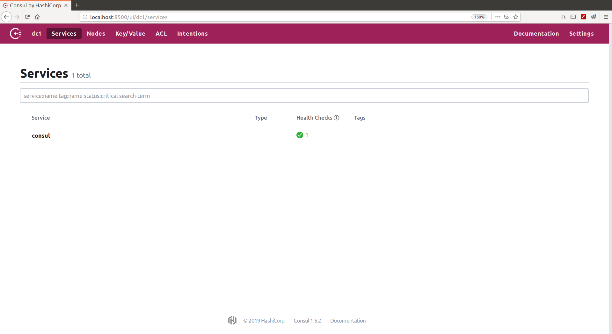
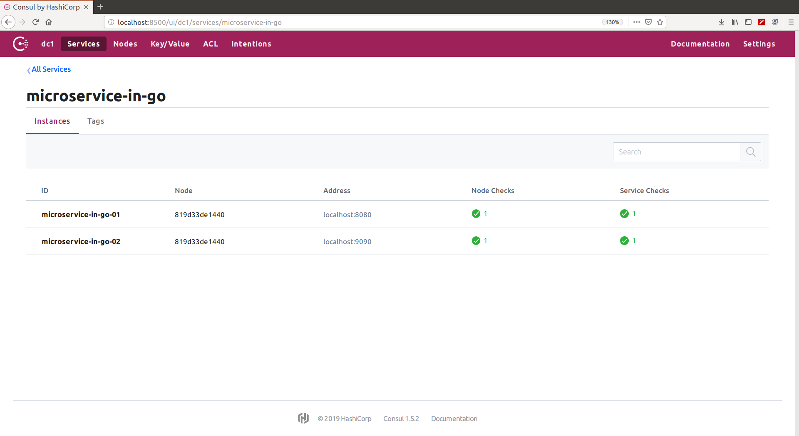

# Microservice discovery

#### Table Of Contents
1. [Document objective](#1-document-objective)
2. [Run Consul](#2-run-consul)
3. [Register services with Consul using REST API](#3-register-services-with-consul-using-rest-api)
4. [Lookup services using the Consul UI and REST API](#4-lookup-services-using-the-consul-ui-and-rest-api)

## 1 Document objective

In this block we are going to:
 
* Use Consul for service discovery
* Perform service endpoint registration using Consul
* Implement microservice discovery with Go

## 2 Run Consul

Deploy Consul and two 'microservice-in-go' microservices in Docker:

```
arturotarin@QOSMIO-X70B:~/go/src/github.com/ArturoTarinVillaescusa/go_cloud_orchestration/go_microservice_frameworks/microservice_discovery
15:10:31 $ docker-compose up -d
Pulling consul (consul:latest)...
latest: Pulling from library/consul
e7c96db7181b: Pull complete
2967157a1cec: Pull complete
89eac26c7594: Pull complete
fed432a284a5: Pull complete
eff914b7f5d7: Pull complete
0c1d0a78f0c3: Pull complete
Digest: sha256:b31edc821d5e3deae8ce9f9a2070dc3fbaa72f5e1746a85a91ebe551ed8fb17f
Status: Downloaded newer image for consul:latest
Creating microservicediscovery_microservice-in-go-02_1 ... done
Creating microservicediscovery_microservice-in-go-01_1 ... done
Creating microservicediscovery_consul_1                ... done
```

Opening a browser and navigating to my Consul UI:



Consul's services catalog starts empty:

```
15:15:19 $ curl http://localhost:8500/v1/catalog/services
{
    "consul": []
}
```

## 3 Register services with Consul using REST API

Register Consul agent 'microservice-in-go-01':

```
arturotarin@QOSMIO-X70B:~/go/src/github.com/ArturoTarinVillaescusa/go_cloud_orchestration/go_microservice_frameworks/microservice_discovery
18:36:41 $ cat register_consul_agent_microservice-in-go-01.json 
{
  "ID": "microservice-in-go-01",
  "Name": "microservice-in-go",
  "Tags": [
    "cloud-native-go",
    "v1"
  ],
  "Address": "localhost",
  "Port": 8080,
  "EnableTagOverride": false,
  "check": {
    "id": "ping",
    "name": "HTTP API on port 8080",
    "http": "http://microservice-in-go-01:8080/ping",
    "interval": "5s",
    "timeout": "1s"
  }
}

arturotarin@QOSMIO-X70B:~/go/src/github.com/ArturoTarinVillaescusa/go_cloud_orchestration/go_microservice_frameworks/microservice_discovery
18:36:47 $ cat register_consul_agent_microservice-in-go-02.json 
{
  "ID": "microservice-in-go-02",
  "Name": "microservice-in-go",
  "Tags": [
    "cloud-native-go",
    "v1"
  ],
  "Address": "localhost",
  "Port": 9090,
  "EnableTagOverride": false,
  "check": {
    "id": "ping",
    "name": "HTTP API on port 9090",
    "http": "http://microservice-in-go-02:9090/ping",
    "interval": "5s",
    "timeout": "1s"
  }
}

arturotarin@QOSMIO-X70B:~/go/src/github.com/ArturoTarinVillaescusa/go_cloud_orchestration/go_microservice_frameworks/microservice_discovery
18:38:37 $ curl -d "@register_consul_agent_microservice-in-go-01.json" -H "Content-Type: application/json" -X PUT http://localhost:8500/v1/agent/service/register

arturotarin@QOSMIO-X70B:~/go/src/github.com/ArturoTarinVillaescusa/go_cloud_orchestration/go_microservice_frameworks/microservice_discovery
19:01:20 $ curl -d "@register_consul_agent_microservice-in-go-02.json" -H "Content-Type: application/json" -X PUT http://localhost:8500/v1/agent/service/register


```

## 4 Lookup services using the Consul UI and REST API

Look at the registered services:



```
arturotarin@QOSMIO-X70B:~/go/src/github.com/ArturoTarinVillaescusa/go_cloud_orchestration/go_microservice_frameworks/microservice_discovery
18:39:10 $ curl http://localhost:8500/v1/catalog/services
{
    "consul": [],
    "microservice-in-go": [
        "cloud-native-go",
        "v1"
    ]
}
(base) 
arturotarin@QOSMIO-X70B:~/go/src/github.com/ArturoTarinVillaescusa/go_cloud_orchestration/go_microservice_frameworks/microservice_discovery
18:39:25 $ curl http://localhost:8500/v1/agent/services
{
    "microservice-in-go-01": {
        "ID": "microservice-in-go-01",
        "Service": "microservice-in-go",
        "Tags": [
            "cloud-native-go",
            "v1"
        ],
        "Meta": {},
        "Port": 8080,
        "Address": "localhost",
        "Weights": {
            "Passing": 1,
            "Warning": 1
        },
        "EnableTagOverride": false
    },
    "microservice-in-go-02": {
        "ID": "microservice-in-go-02",
        "Service": "microservice-in-go",
        "Tags": [
            "cloud-native-go",
            "v1"
        ],
        "Meta": {},
        "Port": 9090,
        "Address": "localhost",
        "Weights": {
            "Passing": 1,
            "Warning": 1
        },
        "EnableTagOverride": false
    }
}
```

Get all the healthchecks information:

```
arturotarin@QOSMIO-X70B:~/go/src/github.com/ArturoTarinVillaescusa/go_cloud_orchestration/go_microservice_frameworks/microservice_discovery
19:09:34 $ curl http://localhost:8500/v1/health/service/microservice-in-go
[
    {
        "Node": {
            "ID": "4f3777fd-01da-afbd-235b-8f946911ed41",
            "Node": "819d33de1440",
            "Address": "127.0.0.1",
            "Datacenter": "dc1",
            "TaggedAddresses": {
                "lan": "127.0.0.1",
                "wan": "127.0.0.1"
            },
            "Meta": {
                "consul-network-segment": ""
            },
            "CreateIndex": 9,
            "ModifyIndex": 10
        },
        "Service": {
            "ID": "microservice-in-go-01",
            "Service": "microservice-in-go",
            "Tags": [
                "cloud-native-go",
                "v1"
            ],
            "Address": "localhost",
            "Meta": null,
            "Port": 8080,
            "Weights": {
                "Passing": 1,
                "Warning": 1
            },
            "EnableTagOverride": false,
            "ProxyDestination": "",
            "Proxy": {},
            "Connect": {},
            "CreateIndex": 407,
            "ModifyIndex": 407
        },
        "Checks": [
            {
                "Node": "819d33de1440",
                "CheckID": "serfHealth",
                "Name": "Serf Health Status",
                "Status": "passing",
                "Notes": "",
                "Output": "Agent alive and reachable",
                "ServiceID": "",
                "ServiceName": "",
                "ServiceTags": [],
                "Definition": {},
                "CreateIndex": 9,
                "ModifyIndex": 9
            },
            {
                "Node": "819d33de1440",
                "CheckID": "service:microservice-in-go-01",
                "Name": "HTTP API on port 8080",
                "Status": "passing",
                "Notes": "",
                "Output": "HTTP GET http://microservice-in-go-01:8080/ping: 200 OK Output: pong",
                "ServiceID": "microservice-in-go-01",
                "ServiceName": "microservice-in-go",
                "ServiceTags": [
                    "cloud-native-go",
                    "v1"
                ],
                "Definition": {},
                "CreateIndex": 407,
                "ModifyIndex": 408
            }
        ]
    },
    {
        "Node": {
            "ID": "4f3777fd-01da-afbd-235b-8f946911ed41",
            "Node": "819d33de1440",
            "Address": "127.0.0.1",
            "Datacenter": "dc1",
            "TaggedAddresses": {
                "lan": "127.0.0.1",
                "wan": "127.0.0.1"
            },
            "Meta": {
                "consul-network-segment": ""
            },
            "CreateIndex": 9,
            "ModifyIndex": 10
        },
        "Service": {
            "ID": "microservice-in-go-02",
            "Service": "microservice-in-go",
            "Tags": [
                "cloud-native-go",
                "v1"
            ],
            "Address": "localhost",
            "Meta": null,
            "Port": 9090,
            "Weights": {
                "Passing": 1,
                "Warning": 1
            },
            "EnableTagOverride": false,
            "ProxyDestination": "",
            "Proxy": {},
            "Connect": {},
            "CreateIndex": 412,
            "ModifyIndex": 412
        },
        "Checks": [
            {
                "Node": "819d33de1440",
                "CheckID": "serfHealth",
                "Name": "Serf Health Status",
                "Status": "passing",
                "Notes": "",
                "Output": "Agent alive and reachable",
                "ServiceID": "",
                "ServiceName": "",
                "ServiceTags": [],
                "Definition": {},
                "CreateIndex": 9,
                "ModifyIndex": 9
            },
            {
                "Node": "819d33de1440",
                "CheckID": "service:microservice-in-go-02",
                "Name": "HTTP API on port 9090",
                "Status": "passing",
                "Notes": "",
                "Output": "HTTP GET http://microservice-in-go-02:9090/ping: 200 OK Output: pong",
                "ServiceID": "microservice-in-go-02",
                "ServiceName": "microservice-in-go",
                "ServiceTags": [
                    "cloud-native-go",
                    "v1"
                ],
                "Definition": {},
                "CreateIndex": 412,
                "ModifyIndex": 413
            }
        ]
    }
]
```

Get the passing api information:

```
arturotarin@QOSMIO-X70B:~/go/src/github.com/ArturoTarinVillaescusa/go_cloud_orchestration/go_microservice_frameworks/microservice_discovery
19:11:26 $ curl http://localhost:8500/v1/health/service/microservice-in-go?passing
[
    {
        "Node": {
            "ID": "4f3777fd-01da-afbd-235b-8f946911ed41",
            "Node": "819d33de1440",
            "Address": "127.0.0.1",
            "Datacenter": "dc1",
            "TaggedAddresses": {
                "lan": "127.0.0.1",
                "wan": "127.0.0.1"
            },
            "Meta": {
                "consul-network-segment": ""
            },
            "CreateIndex": 9,
            "ModifyIndex": 10
        },
        "Service": {
            "ID": "microservice-in-go-01",
            "Service": "microservice-in-go",
            "Tags": [
                "cloud-native-go",
                "v1"
            ],
            "Address": "localhost",
            "Meta": null,
            "Port": 8080,
            "Weights": {
                "Passing": 1,
                "Warning": 1
            },
            "EnableTagOverride": false,
            "ProxyDestination": "",
            "Proxy": {},
            "Connect": {},
            "CreateIndex": 407,
            "ModifyIndex": 407
        },
        "Checks": [
            {
                "Node": "819d33de1440",
                "CheckID": "serfHealth",
                "Name": "Serf Health Status",
                "Status": "passing",
                "Notes": "",
                "Output": "Agent alive and reachable",
                "ServiceID": "",
                "ServiceName": "",
                "ServiceTags": [],
                "Definition": {},
                "CreateIndex": 9,
                "ModifyIndex": 9
            },
            {
                "Node": "819d33de1440",
                "CheckID": "service:microservice-in-go-01",
                "Name": "HTTP API on port 8080",
                "Status": "passing",
                "Notes": "",
                "Output": "HTTP GET http://microservice-in-go-01:8080/ping: 200 OK Output: pong",
                "ServiceID": "microservice-in-go-01",
                "ServiceName": "microservice-in-go",
                "ServiceTags": [
                    "cloud-native-go",
                    "v1"
                ],
                "Definition": {},
                "CreateIndex": 407,
                "ModifyIndex": 408
            }
        ]
    },
    {
        "Node": {
            "ID": "4f3777fd-01da-afbd-235b-8f946911ed41",
            "Node": "819d33de1440",
            "Address": "127.0.0.1",
            "Datacenter": "dc1",
            "TaggedAddresses": {
                "lan": "127.0.0.1",
                "wan": "127.0.0.1"
            },
            "Meta": {
                "consul-network-segment": ""
            },
            "CreateIndex": 9,
            "ModifyIndex": 10
        },
        "Service": {
            "ID": "microservice-in-go-02",
            "Service": "microservice-in-go",
            "Tags": [
                "cloud-native-go",
                "v1"
            ],
            "Address": "localhost",
            "Meta": null,
            "Port": 9090,
            "Weights": {
                "Passing": 1,
                "Warning": 1
            },
            "EnableTagOverride": false,
            "ProxyDestination": "",
            "Proxy": {},
            "Connect": {},
            "CreateIndex": 412,
            "ModifyIndex": 412
        },
        "Checks": [
            {
                "Node": "819d33de1440",
                "CheckID": "serfHealth",
                "Name": "Serf Health Status",
                "Status": "passing",
                "Notes": "",
                "Output": "Agent alive and reachable",
                "ServiceID": "",
                "ServiceName": "",
                "ServiceTags": [],
                "Definition": {},
                "CreateIndex": 9,
                "ModifyIndex": 9
            },
            {
                "Node": "819d33de1440",
                "CheckID": "service:microservice-in-go-02",
                "Name": "HTTP API on port 9090",
                "Status": "passing",
                "Notes": "",
                "Output": "HTTP GET http://microservice-in-go-02:9090/ping: 200 OK Output: pong",
                "ServiceID": "microservice-in-go-02",
                "ServiceName": "microservice-in-go",
                "ServiceTags": [
                    "cloud-native-go",
                    "v1"
                ],
                "Definition": {},
                "CreateIndex": 412,
                "ModifyIndex": 413
            }
        ]
    }
]
```

Get the critical api information:

```
arturotarin@QOSMIO-X70B:~/go/src/github.com/ArturoTarinVillaescusa/go_cloud_orchestration/go_microservice_frameworks/microservice_discovery
19:13:06 $ curl http://localhost:8500/v1/health/state/critical
[]

```
