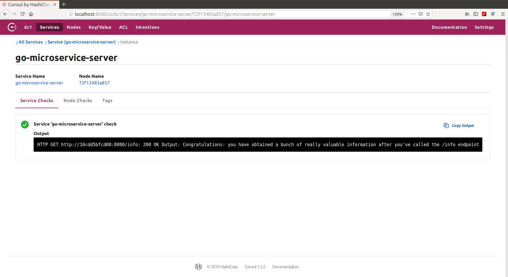

# Microservice discovery

#### Table Of Contents
1. [Document objective](#1-document-objective)
2. [Run Consul](#2-run-consul)
3. [Register services with Consul using REST API](#3-register-services-with-consul-using-rest-api)
4. [Lookup services using the Consul UI and REST API](#4-lookup-services-using-the-consul-ui-and-rest-api)
5. [Go microservices registration with Consul](#5-go-microservices-registration-with-consul)
6. [Go microservices lookup with Consul](#6-go-microservices-lookup-with-consul)

## 1 Document objective

In this block we are going to:
 
* Use Consul for service discovery
* Perform service endpoint registration using Consul
* Implement microservice discovery with Go

## 2 Run Consul

Deploy Consul and two 'microservice-in-go' microservices in Docker:

```
arturotarin@QOSMIO-X70B:~/go/src/github.com/ArturoTarinVillaescusa/go_cloud_orchestration/go_microservice_frameworks/microservice_discovery/just_consul
15:10:31 $ docker-compose up -d
Pulling consul (consul:latest)...
latest: Pulling from library/consul
e7c96db7181b: Pull complete
2967157a1cec: Pull complete
89eac26c7594: Pull complete
fed432a284a5: Pull complete
eff914b7f5d7: Pull complete
0c1d0a78f0c3: Pull complete
Digest: sha256:b31edc821d5e3deae8ce9f9a2070dc3fbaa72f5e1746a85a91ebe551ed8fb17f
Status: Downloaded newer image for consul:latest
Creating microservicediscovery_microservice-in-go-02_1 ... done
Creating microservicediscovery_microservice-in-go-01_1 ... done
Creating microservicediscovery_consul_1                ... done
```

Opening a browser and navigating to my Consul UI:


Consul's services catalog starts empty:

```
15:15:19 $ curl http://localhost:8500/v1/catalog/services
{
    "consul": []
}
```

## 3 Register services with Consul using REST API

Register Consul agent 'microservice-in-go-01':

```
arturotarin@QOSMIO-X70B:~/go/src/github.com/ArturoTarinVillaescusa/go_cloud_orchestration/go_microservice_frameworks/microservice_discovery/just_consul
18:36:41 $ cat register_consul_agent_microservice-in-go-01.json 
{
  "ID": "microservice-in-go-01",
  "Name": "microservice-in-go",
  "Tags": [
    "cloud-native-go",
    "v1"
  ],
  "Address": "localhost",
  "Port": 8080,
  "EnableTagOverride": false,
  "check": {
    "id": "ping",
    "name": "HTTP API on port 8080",
    "http": "http://microservice-in-go-01:8080/ping",
    "interval": "5s",
    "timeout": "1s"
  }
}

arturotarin@QOSMIO-X70B:~/go/src/github.com/ArturoTarinVillaescusa/go_cloud_orchestration/go_microservice_frameworks/microservice_discovery/just_consul
18:36:47 $ cat register_consul_agent_microservice-in-go-02.json 
{
  "ID": "microservice-in-go-02",
  "Name": "microservice-in-go",
  "Tags": [
    "cloud-native-go",
    "v1"
  ],
  "Address": "localhost",
  "Port": 9090,
  "EnableTagOverride": false,
  "check": {
    "id": "ping",
    "name": "HTTP API on port 9090",
    "http": "http://microservice-in-go-02:9090/ping",
    "interval": "5s",
    "timeout": "1s"
  }
}

arturotarin@QOSMIO-X70B:~/go/src/github.com/ArturoTarinVillaescusa/go_cloud_orchestration/go_microservice_frameworks/microservice_discovery/just_consul
18:38:37 $ curl -d "@register_consul_agent_microservice-in-go-01.json" -H "Content-Type: application/json" -X PUT http://localhost:8500/v1/agent/service/register

arturotarin@QOSMIO-X70B:~/go/src/github.com/ArturoTarinVillaescusa/go_cloud_orchestration/go_microservice_frameworks/microservice_discovery/just_consul
19:01:20 $ curl -d "@register_consul_agent_microservice-in-go-02.json" -H "Content-Type: application/json" -X PUT http://localhost:8500/v1/agent/service/register
```
We can unregister a service calling this url:

```
arturotarin@QOSMIO-X70B:~/go/src/github.com/ArturoTarinVillaescusa/go_cloud_orchestration/go_microservice_frameworks/microservice_discovery/just_consul
08:30:59 $ curl -H "Content-Type: application/json" -X PUT http://localhost:8500/v1/agent/service/deregister/microservice-in-go-02
```


## 4 Lookup services using the Consul UI and REST API

Look at the registered services:


```
arturotarin@QOSMIO-X70B:~/go/src/github.com/ArturoTarinVillaescusa/go_cloud_orchestration/go_microservice_frameworks/microservice_discovery/just_consul
18:39:10 $ curl http://localhost:8500/v1/catalog/services
{
    "consul": [],
    "microservice-in-go": [
        "cloud-native-go",
        "v1"
    ]
}
(base) 
arturotarin@QOSMIO-X70B:~/go/src/github.com/ArturoTarinVillaescusa/go_cloud_orchestration/go_microservice_frameworks/microservice_discovery/just_consul
18:39:25 $ curl http://localhost:8500/v1/agent/services
{
    "microservice-in-go-01": {
        "ID": "microservice-in-go-01",
        "Service": "microservice-in-go",
        "Tags": [
            "cloud-native-go",
            "v1"
        ],
        "Meta": {},
        "Port": 8080,
        "Address": "localhost",
        "Weights": {
            "Passing": 1,
            "Warning": 1
        },
        "EnableTagOverride": false
    },
    "microservice-in-go-02": {
        "ID": "microservice-in-go-02",
        "Service": "microservice-in-go",
        "Tags": [
            "cloud-native-go",
            "v1"
        ],
        "Meta": {},
        "Port": 9090,
        "Address": "localhost",
        "Weights": {
            "Passing": 1,
            "Warning": 1
        },
        "EnableTagOverride": false
    }
}
```

Get all the healthchecks information:

```
arturotarin@QOSMIO-X70B:~/go/src/github.com/ArturoTarinVillaescusa/go_cloud_orchestration/go_microservice_frameworks/microservice_discovery/just_consul
19:09:34 $ curl http://localhost:8500/v1/health/service/microservice-in-go
[
    {
        "Node": {
            "ID": "4f3777fd-01da-afbd-235b-8f946911ed41",
            "Node": "819d33de1440",
            "Address": "127.0.0.1",
            "Datacenter": "dc1",
            "TaggedAddresses": {
                "lan": "127.0.0.1",
                "wan": "127.0.0.1"
            },
            "Meta": {
                "consul-network-segment": ""
            },
            "CreateIndex": 9,
            "ModifyIndex": 10
        },
        "Service": {
            "ID": "microservice-in-go-01",
            "Service": "microservice-in-go",
            "Tags": [
                "cloud-native-go",
                "v1"
            ],
            "Address": "localhost",
            "Meta": null,
            "Port": 8080,
            "Weights": {
                "Passing": 1,
                "Warning": 1
            },
            "EnableTagOverride": false,
            "ProxyDestination": "",
            "Proxy": {},
            "Connect": {},
            "CreateIndex": 407,
            "ModifyIndex": 407
        },
        "Checks": [
            {
                "Node": "819d33de1440",
                "CheckID": "serfHealth",
                "Name": "Serf Health Status",
                "Status": "passing",
                "Notes": "",
                "Output": "Agent alive and reachable",
                "ServiceID": "",
                "ServiceName": "",
                "ServiceTags": [],
                "Definition": {},
                "CreateIndex": 9,
                "ModifyIndex": 9
            },
            {
                "Node": "819d33de1440",
                "CheckID": "service:microservice-in-go-01",
                "Name": "HTTP API on port 8080",
                "Status": "passing",
                "Notes": "",
                "Output": "HTTP GET http://microservice-in-go-01:8080/ping: 200 OK Output: pong",
                "ServiceID": "microservice-in-go-01",
                "ServiceName": "microservice-in-go",
                "ServiceTags": [
                    "cloud-native-go",
                    "v1"
                ],
                "Definition": {},
                "CreateIndex": 407,
                "ModifyIndex": 408
            }
        ]
    },
    {
        "Node": {
            "ID": "4f3777fd-01da-afbd-235b-8f946911ed41",
            "Node": "819d33de1440",
            "Address": "127.0.0.1",
            "Datacenter": "dc1",
            "TaggedAddresses": {
                "lan": "127.0.0.1",
                "wan": "127.0.0.1"
            },
            "Meta": {
                "consul-network-segment": ""
            },
            "CreateIndex": 9,
            "ModifyIndex": 10
        },
        "Service": {
            "ID": "microservice-in-go-02",
            "Service": "microservice-in-go",
            "Tags": [
                "cloud-native-go",
                "v1"
            ],
            "Address": "localhost",
            "Meta": null,
            "Port": 9090,
            "Weights": {
                "Passing": 1,
                "Warning": 1
            },
            "EnableTagOverride": false,
            "ProxyDestination": "",
            "Proxy": {},
            "Connect": {},
            "CreateIndex": 412,
            "ModifyIndex": 412
        },
        "Checks": [
            {
                "Node": "819d33de1440",
                "CheckID": "serfHealth",
                "Name": "Serf Health Status",
                "Status": "passing",
                "Notes": "",
                "Output": "Agent alive and reachable",
                "ServiceID": "",
                "ServiceName": "",
                "ServiceTags": [],
                "Definition": {},
                "CreateIndex": 9,
                "ModifyIndex": 9
            },
            {
                "Node": "819d33de1440",
                "CheckID": "service:microservice-in-go-02",
                "Name": "HTTP API on port 9090",
                "Status": "passing",
                "Notes": "",
                "Output": "HTTP GET http://microservice-in-go-02:9090/ping: 200 OK Output: pong",
                "ServiceID": "microservice-in-go-02",
                "ServiceName": "microservice-in-go",
                "ServiceTags": [
                    "cloud-native-go",
                    "v1"
                ],
                "Definition": {},
                "CreateIndex": 412,
                "ModifyIndex": 413
            }
        ]
    }
]
```

Get the passing api information:

```
arturotarin@QOSMIO-X70B:~/go/src/github.com/ArturoTarinVillaescusa/go_cloud_orchestration/go_microservice_frameworks/microservice_discovery/just_consul
19:11:26 $ curl http://localhost:8500/v1/health/service/microservice-in-go?passing
[
    {
        "Node": {
            "ID": "4f3777fd-01da-afbd-235b-8f946911ed41",
            "Node": "819d33de1440",
            "Address": "127.0.0.1",
            "Datacenter": "dc1",
            "TaggedAddresses": {
                "lan": "127.0.0.1",
                "wan": "127.0.0.1"
            },
            "Meta": {
                "consul-network-segment": ""
            },
            "CreateIndex": 9,
            "ModifyIndex": 10
        },
        "Service": {
            "ID": "microservice-in-go-01",
            "Service": "microservice-in-go",
            "Tags": [
                "cloud-native-go",
                "v1"
            ],
            "Address": "localhost",
            "Meta": null,
            "Port": 8080,
            "Weights": {
                "Passing": 1,
                "Warning": 1
            },
            "EnableTagOverride": false,
            "ProxyDestination": "",
            "Proxy": {},
            "Connect": {},
            "CreateIndex": 407,
            "ModifyIndex": 407
        },
        "Checks": [
            {
                "Node": "819d33de1440",
                "CheckID": "serfHealth",
                "Name": "Serf Health Status",
                "Status": "passing",
                "Notes": "",
                "Output": "Agent alive and reachable",
                "ServiceID": "",
                "ServiceName": "",
                "ServiceTags": [],
                "Definition": {},
                "CreateIndex": 9,
                "ModifyIndex": 9
            },
            {
                "Node": "819d33de1440",
                "CheckID": "service:microservice-in-go-01",
                "Name": "HTTP API on port 8080",
                "Status": "passing",
                "Notes": "",
                "Output": "HTTP GET http://microservice-in-go-01:8080/ping: 200 OK Output: pong",
                "ServiceID": "microservice-in-go-01",
                "ServiceName": "microservice-in-go",
                "ServiceTags": [
                    "cloud-native-go",
                    "v1"
                ],
                "Definition": {},
                "CreateIndex": 407,
                "ModifyIndex": 408
            }
        ]
    },
    {
        "Node": {
            "ID": "4f3777fd-01da-afbd-235b-8f946911ed41",
            "Node": "819d33de1440",
            "Address": "127.0.0.1",
            "Datacenter": "dc1",
            "TaggedAddresses": {
                "lan": "127.0.0.1",
                "wan": "127.0.0.1"
            },
            "Meta": {
                "consul-network-segment": ""
            },
            "CreateIndex": 9,
            "ModifyIndex": 10
        },
        "Service": {
            "ID": "microservice-in-go-02",
            "Service": "microservice-in-go",
            "Tags": [
                "cloud-native-go",
                "v1"
            ],
            "Address": "localhost",
            "Meta": null,
            "Port": 9090,
            "Weights": {
                "Passing": 1,
                "Warning": 1
            },
            "EnableTagOverride": false,
            "ProxyDestination": "",
            "Proxy": {},
            "Connect": {},
            "CreateIndex": 412,
            "ModifyIndex": 412
        },
        "Checks": [
            {
                "Node": "819d33de1440",
                "CheckID": "serfHealth",
                "Name": "Serf Health Status",
                "Status": "passing",
                "Notes": "",
                "Output": "Agent alive and reachable",
                "ServiceID": "",
                "ServiceName": "",
                "ServiceTags": [],
                "Definition": {},
                "CreateIndex": 9,
                "ModifyIndex": 9
            },
            {
                "Node": "819d33de1440",
                "CheckID": "service:microservice-in-go-02",
                "Name": "HTTP API on port 9090",
                "Status": "passing",
                "Notes": "",
                "Output": "HTTP GET http://microservice-in-go-02:9090/ping: 200 OK Output: pong",
                "ServiceID": "microservice-in-go-02",
                "ServiceName": "microservice-in-go",
                "ServiceTags": [
                    "cloud-native-go",
                    "v1"
                ],
                "Definition": {},
                "CreateIndex": 412,
                "ModifyIndex": 413
            }
        ]
    }
]
```

Get the critical api information:

```
arturotarin@QOSMIO-X70B:~/go/src/github.com/ArturoTarinVillaescusa/go_cloud_orchestration/go_microservice_frameworks/microservice_discovery/just_consul
19:13:06 $ curl http://localhost:8500/v1/health/state/critical
[]

```
## 5 Go microservices registration with Consul

In this section we will:

* Implement with Go a service endpoint registration to Consul for our Go microservice
* Implement and register health check endpoint
* Run Consul and our Go microservice and see that our development works as expected

First, download the Hashicorp Consul Go libraries:

```
arturotarin@QOSMIO-X70B:~/go/src/github.com/ArturoTarinVillaescusa/go_cloud_orchestration/go_microservice_frameworks/microservice_discovery/with_go
06:47:28 $ go get github.com/hashicorp/consul/api
go get: warning: modules disabled by GO111MODULE=auto in GOPATH/src;
	ignoring ../../../go.mod;
	see 'go help modules'

arturotarin@QOSMIO-X70B:~/go/src/github.com/ArturoTarinVillaescusa/go_cloud_orchestration/go_microservice_frameworks/microservice_discovery/with_go
06:47:59 $ ls /home/arturotarin/go/src/github.com/hashicorp/
consul

```

Next, build the server.go code provided:

```
arturotarin@QOSMIO-X70B:~/go/src/github.com/ArturoTarinVillaescusa/go_cloud_orchestration/go_microservice_frameworks/microservice_discovery/with_go
06:48:01 $ ls
server.go

arturotarin@QOSMIO-X70B:~/go/src/github.com/ArturoTarinVillaescusa/go_cloud_orchestration/go_microservice_frameworks/microservice_discovery/with_go
06:50:34 $ go build -o server

arturotarin@QOSMIO-X70B:~/go/src/github.com/ArturoTarinVillaescusa/go_cloud_orchestration/go_microservice_frameworks/microservice_discovery/with_go
06:50:57 $ ls -lrth
total 7,6M
-rw-rw-r-- 1 arturotarin arturotarin 1,5K jul 20 06:49 server.go
-rwxrwxr-x 1 arturotarin arturotarin 7,6M jul 20 06:50 server

arturotarin@QOSMIO-X70B:~/go/src/github.com/ArturoTarinVillaescusa/go_cloud_orchestration/go_microservice_frameworks/microservice_discovery/with_go
06:51:47 $ ./server 
Starting Go microservice server
```

Next, create the Docker image based in this 'server' runnable file:

```
arturotarin@QOSMIO-X70B:~/go/src/github.com/ArturoTarinVillaescusa/go_cloud_orchestration/go_microservice_frameworks/microservice_discovery/with_go
08:11:49 $ docker-compose build
consul uses an image, skipping
Building go-microservice-server
Step 1/8 : FROM golang:1.12-alpine
 ---> 6b21b4c6e7a3
Step 2/8 : RUN apk update && apk upgrade && apk add --no-cache bash git &&     go get -u github.com/hashicorp/consul/api
 ---> Using cache
 ---> ec267151e2cc
Step 3/8 : ENV SOURCES /go/src/github.com/ArturoTarinVillaescusa/go_cloud_orchestration/go_microservice_frameworks/microservice_discovery/with_go/server/
 ---> Using cache
 ---> 62e21093e1db
Step 4/8 : COPY . ${SOURCES}
 ---> fccb03e7d736
Removing intermediate container 1293f5130649
Step 5/8 : RUN cd ${SOURCES}server/ && CGO_ENABLED=0 go build -o go-microservice-server
 ---> Running in 73e8bb412a27
 ---> fc4f4a05c9d6
Removing intermediate container 73e8bb412a27
Step 6/8 : ENV CONSUL_HTTP_ADDR localhost:8500
 ---> Running in cdbc9e92f9e4
 ---> 8f19a59ca03d
Removing intermediate container cdbc9e92f9e4
Step 7/8 : WORKDIR ${SOURCES}server/
 ---> 8507e8415582
Removing intermediate container aabf2f804123
Step 8/8 : CMD ${SOURCES}server/go-microservice-server
 ---> Running in 2e5eb99ad157
 ---> ca7bbf8dffbf
Removing intermediate container 2e5eb99ad157
Successfully built ca7bbf8dffbf
Successfully tagged go-microservice-server:1.0.0
```

List the Docker images:

```
arturotarin@QOSMIO-X70B:~/go/src/github.com/ArturoTarinVillaescusa/go_cloud_orchestration/go_microservice_frameworks/microservice_discovery/with_go
07:52:03 $ docker images
REPOSITORY                TAG                 IMAGE ID            CREATED             SIZE
go-microservice-server             1.0.0               b0864ef7cdbb        47 seconds ago      584MB
go-microservice           1.0.0               6e044057cc9a        17 hours ago        487MB
arturot/go-microservice   1.0.0               d47bd5746538        20 hours ago        477MB
golang                    1.12-alpine         6b21b4c6e7a3        8 days ago          350MB
consul                    latest              7d52b83f718f        3 weeks ago         115MB
```

Start Consul and the Go microservice:
```
arturotarin@QOSMIO-X70B:~/go/src/github.com/ArturoTarinVillaescusa/go_cloud_orchestration/go_microservice_frameworks/microservice_discovery/with_go
07:52:49 $ docker-compose up
Starting withgo_consul_1 ... done
Recreating withgo_go-microservice-server_1 ... done
Attaching to withgo_consul_1, withgo_go-microservice-server_1
go-microservice-server_1  | Starting Go microservice server.
consul_1         | ==> Starting Consul agent...
consul_1         |            Version: 'v1.5.2'
consul_1         |            Node ID: 'ddfbaeb0-1926-b72f-deee-a446df74fc97'
consul_1         |          Node name: '72f13483a857'
consul_1         |         Datacenter: 'dc1' (Segment: '<all>')
consul_1         |             Server: true (Bootstrap: false)
consul_1         |        Client Addr: [0.0.0.0] (HTTP: 8500, HTTPS: -1, gRPC: 8502, DNS: 8600)
consul_1         |       Cluster Addr: 127.0.0.1 (LAN: 8301, WAN: 8302)
consul_1         |            Encrypt: Gossip: false, TLS-Outgoing: false, TLS-Incoming: false, Auto-Encrypt-TLS: false
consul_1         | 
consul_1         | ==> Log data will now stream in as it occurs:
consul_1         | 
consul_1         |     2019/07/20 06:13:39 [DEBUG] tlsutil: Update with version 1
consul_1         |     2019/07/20 06:13:39 [DEBUG] tlsutil: OutgoingRPCWrapper with version 1
consul_1         |     2019/07/20 06:13:39 [INFO]  raft: Initial configuration (index=1): [{Suffrage:Voter ID:ddfbaeb0-1926-b72f-deee-a446df74fc97 Address:127.0.0.1:8300}]
consul_1         |     2019/07/20 06:13:39 [INFO]  raft: Node at 127.0.0.1:8300 [Follower] entering Follower state (Leader: "")
consul_1         |     2019/07/20 06:13:39 [INFO] serf: EventMemberJoin: 72f13483a857.dc1 127.0.0.1
consul_1         |     2019/07/20 06:13:39 [INFO] serf: EventMemberJoin: 72f13483a857 127.0.0.1
consul_1         |     2019/07/20 06:13:39 [INFO] consul: Handled member-join event for server "72f13483a857.dc1" in area "wan"
consul_1         |     2019/07/20 06:13:39 [INFO] consul: Adding LAN server 72f13483a857 (Addr: tcp/127.0.0.1:8300) (DC: dc1)
consul_1         |     2019/07/20 06:13:39 [DEBUG] agent: restored service definition "go-microservice-server" from "/consul/data/services/7a3514b8a6c6c9c4b5175d2e945565bb"
consul_1         |     2019/07/20 06:13:39 [DEBUG] tlsutil: OutgoingTLSConfigForCheck with version 1
consul_1         |     2019/07/20 06:13:39 [DEBUG] agent: restored health check "service:go-microservice-server" from "/consul/data/checks/5cb16499c28118418f6f31578cf466c6"
consul_1         |     2019/07/20 06:13:39 [DEBUG] agent/proxy: managed Connect proxy manager started
consul_1         |     2019/07/20 06:13:39 [INFO] agent: Started DNS server 0.0.0.0:8600 (udp)
consul_1         |     2019/07/20 06:13:39 [INFO] agent: Started DNS server 0.0.0.0:8600 (tcp)
consul_1         |     2019/07/20 06:13:39 [INFO] agent: Started HTTP server on [::]:8500 (tcp)
consul_1         |     2019/07/20 06:13:39 [INFO] agent: started state syncer
consul_1         | ==> Consul agent running!
consul_1         |     2019/07/20 06:13:39 [INFO] agent: Started gRPC server on [::]:8502 (tcp)
consul_1         |     2019/07/20 06:13:39 [WARN]  raft: Heartbeat timeout from "" reached, starting election
consul_1         |     2019/07/20 06:13:39 [INFO]  raft: Node at 127.0.0.1:8300 [Candidate] entering Candidate state in term 2
consul_1         |     2019/07/20 06:13:39 [DEBUG] raft: Votes needed: 1
consul_1         |     2019/07/20 06:13:39 [DEBUG] raft: Vote granted from ddfbaeb0-1926-b72f-deee-a446df74fc97 in term 2. Tally: 1
consul_1         |     2019/07/20 06:13:39 [INFO]  raft: Election won. Tally: 1
consul_1         |     2019/07/20 06:13:39 [INFO]  raft: Node at 127.0.0.1:8300 [Leader] entering Leader state
consul_1         |     2019/07/20 06:13:39 [INFO] consul: cluster leadership acquired
consul_1         |     2019/07/20 06:13:39 [INFO] consul: New leader elected: 72f13483a857
consul_1         |     2019/07/20 06:13:39 [INFO] connect: initialized primary datacenter CA with provider "consul"
consul_1         |     2019/07/20 06:13:39 [DEBUG] consul: Skipping self join check for "72f13483a857" since the cluster is too small
consul_1         |     2019/07/20 06:13:39 [INFO] consul: member '72f13483a857' joined, marking health alive
consul_1         |     2019/07/20 06:13:39 [DEBUG] agent: Skipping remote check "serfHealth" since it is managed automatically
consul_1         |     2019/07/20 06:13:39 [INFO] agent: Synced service "go-microservice-server"
consul_1         |     2019/07/20 06:13:39 [DEBUG] agent: Check "service:go-microservice-server" in sync
consul_1         |     2019/07/20 06:13:39 [DEBUG] agent: Node info in sync
consul_1         |     2019/07/20 06:13:40 [DEBUG] agent: Skipping remote check "serfHealth" since it is managed automatically
consul_1         |     2019/07/20 06:13:40 [DEBUG] agent: Service "go-microservice-server" in sync
consul_1         |     2019/07/20 06:13:40 [DEBUG] agent: Check "service:go-microservice-server" in sync
consul_1         |     2019/07/20 06:13:40 [DEBUG] agent: Node info in sync
consul_1         |     2019/07/20 06:13:40 [DEBUG] agent: Service "go-microservice-server" in sync
consul_1         |     2019/07/20 06:13:40 [DEBUG] agent: Check "service:go-microservice-server" in sync
consul_1         |     2019/07/20 06:13:40 [DEBUG] agent: Node info in sync
consul_1         |     2019/07/20 06:13:41 [DEBUG] tlsutil: OutgoingRPCWrapper with version 1
consul_1         |     2019/07/20 06:13:43 [DEBUG] tlsutil: OutgoingTLSConfigForCheck with version 1
consul_1         |     2019/07/20 06:13:43 [WARN] agent: Check "service:go-microservice-server" HTTP request failed: Get http://726d6c0a6298:80/info: net/http: request canceled while waiting for connection (Client.Timeout exceeded while awaiting headers)
consul_1         |     2019/07/20 06:13:43 [INFO] agent: Synced service "go-microservice-server"
consul_1         |     2019/07/20 06:13:43 [DEBUG] agent: Check "service:go-microservice-server" in sync
consul_1         |     2019/07/20 06:13:43 [DEBUG] agent: Node info in sync
consul_1         |     2019/07/20 06:13:43 [DEBUG] http: Request PUT /v1/agent/service/register (188.300145ms) from=172.29.0.3:49550
consul_1         |     2019/07/20 06:13:43 [DEBUG] agent: Service "go-microservice-server" in sync
consul_1         |     2019/07/20 06:13:43 [DEBUG] agent: Check "service:go-microservice-server" in sync
consul_1         |     2019/07/20 06:13:43 [DEBUG] agent: Node info in sync
go-microservice-server_1  | The /info endpoint is being called...
consul_1         |     2019/07/20 06:13:48 [DEBUG] agent: Check "service:go-microservice-server" is passing
consul_1         |     2019/07/20 06:13:48 [DEBUG] agent: Service "go-microservice-server" in sync
consul_1         |     2019/07/20 06:13:48 [INFO] agent: Synced check "service:go-microservice-server"
consul_1         |     2019/07/20 06:13:48 [DEBUG] agent: Node info in sync
go-microservice-server_1  | The /info endpoint is being called...
consul_1         |     2019/07/20 06:13:53 [DEBUG] agent: Check "service:go-microservice-server" is passing
go-microservice-server_1  | The /info endpoint is being called...
consul_1         |     2019/07/20 06:13:58 [DEBUG] agent: Check "service:go-microservice-server" is passing
```

## 6 Go microservices lookup with Consul

In this section we will:

* Lookup the Go server microservice using Consul UI and Consul REST API calls
* Implement a client microservice application with Go
* Implement a service endpoint lookup via Consul
* Run Consul and our client and server Go microservices all together and see that our development works as expected

So this is what we can see this from either the Consul UI or from command line Consul REST API calls:



```
arturotarin@QOSMIO-X70B:~/go/src/github.com/ArturoTarinVillaescusa/go_cloud_orchestration/go_microservice_frameworks/microservice_discovery/just_consul
18:39:10 $ curl http://localhost:8500/v1/catalog/services
{
    "consul": [],
    "go-microservice-server": []
}

arturotarin@QOSMIO-X70B:~/go/src/github.com/ArturoTarinVillaescusa/go_cloud_orchestration/go_microservice_frameworks/microservice_discovery/just_consul
18:39:25 $ curl http://localhost:8500/v1/agent/services
{
    "go-microservice-server": {
        "ID": "go-microservice-server",
        "Service": "go-microservice-server",
        "Tags": [],
        "Meta": {},
        "Port": 8080,
        "Address": "10cdd5bfcd08",
        "Weights": {
            "Passing": 1,
            "Warning": 1
        },
        "EnableTagOverride": false
    }
}
```

But the good thing is that a Go microservice client like the provided in our example can find the 
Go microservice server example using the Consul APIs as well. Let's see how.

First, build the go-microservice-client and test it locally:

```
arturotarin@QOSMIO-X70B:~/go/src/github.com/ArturoTarinVillaescusa/go_cloud_orchestration/go_microservice_frameworks/microservice_discovery/with_go/client
18:38:26 $ go build -o go-microservice-client

arturotarin@QOSMIO-X70B:~/go/src/github.com/ArturoTarinVillaescusa/go_cloud_orchestration/go_microservice_frameworks/microservice_discovery/with_go/client
18:38:48 $ ls -lrth
total 15M
-rw-rw-r-- 1 arturotarin arturotarin  570 jul 20 16:54 Dockerfile
-rw-rw-r-- 1 arturotarin arturotarin 1,3K jul 20 18:38 client.go
-rwxrwxr-x 1 arturotarin arturotarin 7,2M jul 20 18:38 client
-rwxrwxr-x 1 arturotarin arturotarin 7,2M jul 20 18:38 go-microservice-client
```

Test it locally:

```
arturotarin@QOSMIO-X70B:~/go/src/github.com/ArturoTarinVillaescusa/go_cloud_orchestration/go_microservice_frameworks/microservice_discovery/with_go/client
18:38:50 $ ./go-microservice-client 
Starting Go microservice client.
```

And see what is going on in Consul log:

```
consul_1                  |     2019/07/20 16:40:47 [DEBUG] http: Request GET /v1/agent/services (1.167346ms) from=172.29.0.1:48308
```

Now let's add this block in the docker-compose.yml file (already done):

```
  go-microservice-client:
    build:
      context: .
      dockerfile: client/Dockerfile
    image: go-microservice-client:1.0.0
    environment:
      - CONSUL_HTTP_ADDR=consul:8500
    depends_on:
      - consul
      - go-microservice-server
    networks:
      - my-net
```

And run the three all together, Consul, go-microservice-server and go-microservice-client:

```
arturotarin@QOSMIO-X70B:~/go/src/github.com/ArturoTarinVillaescusa/go_cloud_orchestration/go_microservice_frameworks/microservice_discovery/with_go
19:51:33 $ docker-compose up
Creating withgo_consul_1 ... done
Creating withgo_go-microservice-server_1 ... done
Creating withgo_go-microservice-client_1 ... done
Attaching to withgo_consul_1, withgo_go-microservice-server_1, withgo_go-microservice-client_1
consul_1                  | ==> Starting Consul agent...
consul_1                  |            Version: 'v1.5.2'
consul_1                  |            Node ID: 'a8a393e2-f416-f7e0-6945-622760ea7d1a'
consul_1                  |          Node name: 'b0aa3906d740'
consul_1                  |         Datacenter: 'dc1' (Segment: '<all>')
consul_1                  |             Server: true (Bootstrap: false)
consul_1                  |        Client Addr: [0.0.0.0] (HTTP: 8500, HTTPS: -1, gRPC: 8502, DNS: 8600)
go-microservice-server_1  | Starting Go microservice server.
go-microservice-client_1  | Starting Go microservice client.
consul_1                  |       Cluster Addr: 127.0.0.1 (LAN: 8301, WAN: 8302)
consul_1                  |            Encrypt: Gossip: false, TLS-Outgoing: false, TLS-Incoming: false, Auto-Encrypt-TLS: false
consul_1                  | 
consul_1                  | ==> Log data will now stream in as it occurs:
consul_1                  | 
consul_1                  |     2019/07/20 17:51:42 [DEBUG] agent: Using random ID "a8a393e2-f416-f7e0-6945-622760ea7d1a" as node ID
consul_1                  |     2019/07/20 17:51:42 [DEBUG] tlsutil: Update with version 1
go-microservice-server_1  | The /info endpoint is being called...
consul_1                  |     2019/07/20 17:51:42 [DEBUG] tlsutil: OutgoingRPCWrapper with version 1
consul_1                  |     2019/07/20 17:51:42 [INFO]  raft: Initial configuration (index=1): [{Suffrage:Voter ID:a8a393e2-f416-f7e0-6945-622760ea7d1a Address:127.0.0.1:8300}]
consul_1                  |     2019/07/20 17:51:42 [INFO]  raft: Node at 127.0.0.1:8300 [Follower] entering Follower state (Leader: "")
consul_1                  |     2019/07/20 17:51:42 [INFO] serf: EventMemberJoin: b0aa3906d740.dc1 127.0.0.1
consul_1                  |     2019/07/20 17:51:42 [INFO] serf: EventMemberJoin: b0aa3906d740 127.0.0.1
consul_1                  |     2019/07/20 17:51:42 [INFO] consul: Adding LAN server b0aa3906d740 (Addr: tcp/127.0.0.1:8300) (DC: dc1)
consul_1                  |     2019/07/20 17:51:42 [INFO] consul: Handled member-join event for server "b0aa3906d740.dc1" in area "wan"
consul_1                  |     2019/07/20 17:51:42 [DEBUG] agent/proxy: managed Connect proxy manager started
consul_1                  |     2019/07/20 17:51:42 [INFO] agent: Started DNS server 0.0.0.0:8600 (tcp)
consul_1                  |     2019/07/20 17:51:42 [INFO] agent: Started DNS server 0.0.0.0:8600 (udp)
consul_1                  |     2019/07/20 17:51:42 [INFO] agent: Started HTTP server on [::]:8500 (tcp)
consul_1                  |     2019/07/20 17:51:42 [INFO] agent: Started gRPC server on [::]:8502 (tcp)
consul_1                  |     2019/07/20 17:51:42 [INFO] agent: started state syncer
consul_1                  | ==> Consul agent running!
consul_1                  |     2019/07/20 17:51:42 [WARN]  raft: Heartbeat timeout from "" reached, starting election
consul_1                  |     2019/07/20 17:51:42 [INFO]  raft: Node at 127.0.0.1:8300 [Candidate] entering Candidate state in term 2
consul_1                  |     2019/07/20 17:51:42 [DEBUG] raft: Votes needed: 1
consul_1                  |     2019/07/20 17:51:42 [DEBUG] raft: Vote granted from a8a393e2-f416-f7e0-6945-622760ea7d1a in term 2. Tally: 1
consul_1                  |     2019/07/20 17:51:42 [INFO]  raft: Election won. Tally: 1
consul_1                  |     2019/07/20 17:51:42 [INFO]  raft: Node at 127.0.0.1:8300 [Leader] entering Leader state
consul_1                  |     2019/07/20 17:51:42 [INFO] consul: cluster leadership acquired
consul_1                  |     2019/07/20 17:51:42 [INFO] consul: New leader elected: b0aa3906d740
consul_1                  |     2019/07/20 17:51:42 [INFO] connect: initialized primary datacenter CA with provider "consul"
consul_1                  |     2019/07/20 17:51:42 [DEBUG] consul: Skipping self join check for "b0aa3906d740" since the cluster is too small
consul_1                  |     2019/07/20 17:51:42 [INFO] consul: member 'b0aa3906d740' joined, marking health alive
consul_1                  |     2019/07/20 17:51:43 [DEBUG] agent: Skipping remote check "serfHealth" since it is managed automatically
consul_1                  |     2019/07/20 17:51:43 [INFO] agent: Synced node info
consul_1                  |     2019/07/20 17:51:43 [DEBUG] agent: Node info in sync
consul_1                  |     2019/07/20 17:51:44 [DEBUG] tlsutil: OutgoingRPCWrapper with version 1
consul_1                  |     2019/07/20 17:51:45 [DEBUG] agent: Skipping remote check "serfHealth" since it is managed automatically
consul_1                  |     2019/07/20 17:51:45 [DEBUG] agent: Node info in sync
consul_1                  |     2019/07/20 17:51:46 [DEBUG] tlsutil: OutgoingTLSConfigForCheck with version 1
consul_1                  |     2019/07/20 17:51:46 [INFO] agent: Synced service "go-microservice-server"
consul_1                  |     2019/07/20 17:51:46 [DEBUG] agent: Check "service:go-microservice-server" in sync
consul_1                  |     2019/07/20 17:51:46 [DEBUG] agent: Node info in sync
consul_1                  |     2019/07/20 17:51:46 [DEBUG] http: Request PUT /v1/agent/service/register (404.693622ms) from=172.29.0.3:42478
consul_1                  |     2019/07/20 17:51:46 [DEBUG] agent: Service "go-microservice-server" in sync
consul_1                  |     2019/07/20 17:51:46 [DEBUG] agent: Check "service:go-microservice-server" in sync
consul_1                  |     2019/07/20 17:51:46 [DEBUG] agent: Node info in sync
consul_1                  |     2019/07/20 17:51:49 [DEBUG] agent: Check "service:go-microservice-server" is passing
consul_1                  |     2019/07/20 17:51:49 [DEBUG] agent: Service "go-microservice-server" in sync
consul_1                  |     2019/07/20 17:51:49 [INFO] agent: Synced check "service:go-microservice-server"
consul_1                  |     2019/07/20 17:51:49 [DEBUG] agent: Node info in sync
consul_1                  |     2019/07/20 17:51:49 [DEBUG] http: Request GET /v1/agent/services (1.182676ms) from=172.29.0.4:39862
go-microservice-server_1  | The /info endpoint is being called...
consul_1                  |     2019/07/20 17:51:54 [DEBUG] agent: Check "service:go-microservice-server" is passing
go-microservice-server_1  | The /info endpoint is being called...
go-microservice-client_1  | Congratulations: you have obtained a bunch of really valuable information after you've called the /info endpoint. Time is 2019-07-20 17:51:54.839648149 +0000 UTC m=+5.003828300
go-microservice-server_1  | The /info endpoint is being called...
consul_1                  |     2019/07/20 17:51:59 [DEBUG] agent: Check "service:go-microservice-server" is passing
go-microservice-server_1  | The /info endpoint is being called...
go-microservice-client_1  | Congratulations: you have obtained a bunch of really valuable information after you've called the /info endpoint. Time is 2019-07-20 17:51:59.839703835 +0000 UTC m=+10.003884007
go-microservice-server_1  | The /info endpoint is being called...
consul_1                  |     2019/07/20 17:52:04 [DEBUG] agent: Check "service:go-microservice-server" is passing
go-microservice-server_1  | The /info endpoint is being called...
go-microservice-client_1  | Congratulations: you have obtained a bunch of really valuable information after you've called the /info endpoint. Time is 2019-07-20 17:52:04.839611529 +0000 UTC m=+15.003791742
go-microservice-server_1  | The /info endpoint is being called...
consul_1                  |     2019/07/20 17:52:09 [DEBUG] agent: Check "service:go-microservice-server" is passing
go-microservice-server_1  | The /info endpoint is being called...
go-microservice-client_1  | Congratulations: you have obtained a bunch of really valuable information after you've called the /info endpoint. Time is 2019-07-20 17:52:09.839656327 +0000 UTC m=+20.003836519
go-microservice-server_1  | The /info endpoint is being called...
consul_1                  |     2019/07/20 17:52:14 [DEBUG] agent: Check "service:go-microservice-server" is passing
go-microservice-server_1  | The /info endpoint is being called...
go-microservice-client_1  | Congratulations: you have obtained a bunch of really valuable information after you've called the /info endpoint. Time is 2019-07-20 17:52:14.839707265 +0000 UTC m=+25.003887513
go-microservice-server_1  | The /info endpoint is being called...
consul_1                  |     2019/07/20 17:52:19 [DEBUG] agent: Check "service:go-microservice-server" is passing
go-microservice-server_1  | The /info endpoint is being called...
go-microservice-client_1  | Congratulations: you have obtained a bunch of really valuable information after you've called the /info endpoint. Time is 2019-07-20 17:52:19.83978128 +0000 UTC m=+30.003961452
go-microservice-server_1  | The /info endpoint is being called...
consul_1                  |     2019/07/20 17:52:24 [DEBUG] agent: Check "service:go-microservice-server" is passing
go-microservice-server_1  | The /info endpoint is being called...
go-microservice-client_1  | Congratulations: you have obtained a bunch of really valuable information after you've called the /info endpoint. Time is 2019-07-20 17:52:24.839706182 +0000 UTC m=+35.003886374
go-microservice-server_1  | The /info endpoint is being called...
consul_1                  |     2019/07/20 17:52:29 [DEBUG] agent: Check "service:go-microservice-server" is passing
go-microservice-server_1  | The /info endpoint is being called...
go-microservice-client_1  | Congratulations: you have obtained a bunch of really valuable information after you've called the /info endpoint. Time is 2019-07-20 17:52:29.839661362 +0000 UTC m=+40.003841441
go-microservice-server_1  | The /info endpoint is being called...
consul_1                  |     2019/07/20 17:52:34 [DEBUG] agent: Check "service:go-microservice-server" is passing
go-microservice-server_1  | The /info endpoint is being called...
go-microservice-client_1  | Congratulations: you have obtained a bunch of really valuable information after you've called the /info endpoint. Time is 2019-07-20 17:52:34.839644966 +0000 UTC m=+45.003825159
```

You can also look at the same information if you trace the go-microservice-client logs:

```
arturotarin@QOSMIO-X70B:~/go/src/github.com/ArturoTarinVillaescusa/go_cloud_orchestration/go_microservice_frameworks/microservice_discovery/with_go/client
19:43:24 $ docker ps
CONTAINER ID        IMAGE                          COMMAND                  CREATED             STATUS              PORTS                                                                                                                      NAMES
eb126a18524d        go-microservice-client:1.0.0   "/bin/sh -c ${SOUR..."   20 seconds ago      Up 16 seconds                                                                                                                                  withgo_go-microservice-client_1
9da7180f545a        go-microservice-server:1.0.0   "/bin/sh -c ${SOUR..."   24 seconds ago      Up 20 seconds                                                                                                                                  withgo_go-microservice-server_1
b0aa3906d740        consul:latest                  "docker-entrypoint..."   29 seconds ago      Up 24 seconds       0.0.0.0:8300->8300/tcp, 0.0.0.0:8400->8400/tcp, 8301-8302/tcp, 8301-8302/udp, 0.0.0.0:8500->8500/tcp, 8600/tcp, 8600/udp   withgo_consul_1

arturotarin@QOSMIO-X70B:~/go/src/github.com/ArturoTarinVillaescusa/go_cloud_orchestration/go_microservice_frameworks/microservice_discovery/with_go/client
19:52:26 $ docker logs eb126a18524d
Starting Go microservice client.
Congratulations: you have obtained a bunch of really valuable information after you've called the /info endpoint. Time is 2019-07-20 17:51:54.839648149 +0000 UTC m=+5.003828300
Congratulations: you have obtained a bunch of really valuable information after you've called the /info endpoint. Time is 2019-07-20 17:51:59.839703835 +0000 UTC m=+10.003884007
Congratulations: you have obtained a bunch of really valuable information after you've called the /info endpoint. Time is 2019-07-20 17:52:04.839611529 +0000 UTC m=+15.003791742
Congratulations: you have obtained a bunch of really valuable information after you've called the /info endpoint. Time is 2019-07-20 17:52:09.839656327 +0000 UTC m=+20.003836519
Congratulations: you have obtained a bunch of really valuable information after you've called the /info endpoint. Time is 2019-07-20 17:52:14.839707265 +0000 UTC m=+25.003887513
Congratulations: you have obtained a bunch of really valuable information after you've called the /info endpoint. Time is 2019-07-20 17:52:19.83978128 +0000 UTC m=+30.003961452
Congratulations: you have obtained a bunch of really valuable information after you've called the /info endpoint. Time is 2019-07-20 17:52:24.839706182 +0000 UTC m=+35.003886374
Congratulations: you have obtained a bunch of really valuable information after you've called the /info endpoint. Time is 2019-07-20 17:52:29.839661362 +0000 UTC m=+40.003841441
```


Let's check how does lookup behave when things get complicated, i.e. what happens in the go-microservice-client 
in case the go-microservice-server goes down? Also, what happens in Consul?

To check it, lets stop the go-microservice-server container manually in Docker:
```
arturotarin@QOSMIO-X70B:~/go/src/github.com/ArturoTarinVillaescusa/go_cloud_orchestration/go_microservice_frameworks/microservice_discovery/with_go/client
19:52:29 $ docker ps
CONTAINER ID        IMAGE                          COMMAND                  CREATED             STATUS              PORTS                                                                                                                      NAMES
eb126a18524d        go-microservice-client:1.0.0   "/bin/sh -c ${SOUR..."   6 minutes ago       Up 4 seconds                                                                                                                                   withgo_go-microservice-client_1
9da7180f545a        go-microservice-server:1.0.0   "/bin/sh -c ${SOUR..."   6 minutes ago       Up 6 minutes                                                                                                                                   withgo_go-microservice-server_1
b0aa3906d740        consul:latest                  "docker-entrypoint..."   6 minutes ago       Up 6 minutes        0.0.0.0:8300->8300/tcp, 0.0.0.0:8400->8400/tcp, 8301-8302/tcp, 8301-8302/udp, 0.0.0.0:8500->8500/tcp, 8600/tcp, 8600/udp   withgo_consul_1

arturotarin@QOSMIO-X70B:~/go/src/github.com/ArturoTarinVillaescusa/go_cloud_orchestration/go_microservice_frameworks/microservice_discovery/with_go/client
19:58:21 $ docker stop 9da7180f545a
9da7180f545a
```

What we can see is this log in the go-microservice-client and Consul logs:

```
go-microservice-server_1  | The /info endpoint is being called...
go-microservice-client_1  | Congratulations: you have obtained a bunch of really valuable information after you've called the /info endpoint. Time is 2019-07-20 17:58:51.147124403 +0000 UTC m=+35.002978711
consul_1                  |     2019/07/20 17:58:54 [WARN] agent: Check "service:go-microservice-server" HTTP request failed: Get http://9da7180f545a:8080/info: dial tcp: lookup 9da7180f545a on 127.0.0.11:53: no such host
consul_1                  |     2019/07/20 17:58:54 [DEBUG] agent: Service "go-microservice-server" in sync
consul_1                  |     2019/07/20 17:58:54 [INFO] agent: Synced check "service:go-microservice-server"
consul_1                  |     2019/07/20 17:58:54 [DEBUG] agent: Node info in sync
withgo_go-microservice-server_1 exited with code 2
consul_1                  |     2019/07/20 17:59:02 [WARN] agent: Check "service:go-microservice-server" HTTP request failed: Get http://9da7180f545a:8080/info: net/http: request canceled while waiting for connection (Client.Timeout exceeded while awaiting headers)
go-microservice-client_1  | Get http://9da7180f545a:8080/info: net/http: request canceled while waiting for connection (Client.Timeout exceeded while awaiting headers)
go-microservice-client_1  | Get http://9da7180f545a:8080/info: dial tcp: lookup 9da7180f545a on 127.0.0.11:53: read udp 127.0.0.1:45400->127.0.0.11:53: i/o timeout
consul_1                  |     2019/07/20 17:59:07 [WARN] agent: Check "service:go-microservice-server" HTTP request failed: Get http://9da7180f545a:8080/info: dial tcp: lookup 9da7180f545a on 127.0.0.11:53: no such host
go-microservice-client_1  | Get http://9da7180f545a:8080/info: dial tcp: lookup 9da7180f545a on 127.0.0.11:53: no such host
consul_1                  |     2019/07/20 17:59:12 [WARN] agent: Check "service:go-microservice-server" HTTP request failed: Get http://9da7180f545a:8080/info: dial tcp: lookup 9da7180f545a on 127.0.0.11:53: no such host
go-microservice-client_1  | Get http://9da7180f545a:8080/info: dial tcp: lookup 9da7180f545a on 127.0.0.11:53: no such host
consul_1                  |     2019/07/20 17:59:17 [WARN] agent: Check "service:go-microservice-server" HTTP request failed: Get http://9da7180f545a:8080/info: dial tcp: lookup 9da7180f545a on 127.0.0.11:53: no such host
consul_1                  |     2019/07/20 17:59:20 [DEBUG] tlsutil: OutgoingTLSConfigForCheck with version 1
consul_1                  |     2019/07/20 17:59:20 [WARN] agent: Check "service:go-microservice-server" HTTP request failed: Get http://9da7180f545a:8080/info: dial tcp 172.29.0.3:8080: connect: connection refused
go-microservice-client_1  | Get http://9da7180f545a:8080/info: dial tcp 172.29.0.3:8080: connect: connection refused
```

And if we start up again the go-microservice-server, what happens then?

```
arturotarin@QOSMIO-X70B:~/go/src/github.com/ArturoTarinVillaescusa/go_cloud_orchestration/go_microservice_frameworks/microservice_discovery/with_go/client
19:58:54 $ docker start 9da7180f545a
9da7180f545a
```

First, what it happens is that the go-microservice-server log is written:

```
go-microservice-server_1  | Starting Go microservice server.
go-microservice-server_1  | The /info endpoint is being called...
go-microservice-server_1  | The /info endpoint is being called...
go-microservice-server_1  | The /info endpoint is being called...
go-microservice-server_1  | The /info endpoint is being called...
go-microservice-server_1  | The /info endpoint is being called...
go-microservice-server_1  | The /info endpoint is being called...
go-microservice-server_1  | The /info endpoint is being called...
go-microservice-server_1  | The /info endpoint is being called...
go-microservice-server_1  | The /info endpoint is being called...
go-microservice-server_1  | The /info endpoint is being called...
go-microservice-server_1  | The /info endpoint is being called...
go-microservice-server_1  | The /info endpoint is being called...
go-microservice-server_1  | The /info endpoint is being called...
go-microservice-server_1  | The /info endpoint is being called...
go-microservice-server_1  | The /info endpoint is being called...
go-microservice-server_1  | The /info endpoint is being called...
go-microservice-server_1  | The /info endpoint is being called...
go-microservice-server_1  | The /info endpoint is being called...
go-microservice-server_1  | The /info endpoint is being called...
go-microservice-server_1  | The /info endpoint is being called...
go-microservice-server_1  | The /info endpoint is being called...
go-microservice-server_1  | The /info endpoint is being called...
go-microservice-server_1  | The /info endpoint is being called...
go-microservice-server_1  | The /info endpoint is being called...
go-microservice-server_1  | The /info endpoint is being called...
go-microservice-server_1  | The /info endpoint is being called...
go-microservice-server_1  | The /info endpoint is being called...
go-microservice-server_1  | The /info endpoint is being called...
go-microservice-server_1  | The /info endpoint is being called...
go-microservice-server_1  | The /info endpoint is being called...
go-microservice-server_1  | The /info endpoint is being called...
go-microservice-server_1  | The /info endpoint is being called...
go-microservice-server_1  | The /info endpoint is being called...
go-microservice-server_1  | The /info endpoint is being called...
go-microservice-server_1  | The /info endpoint is being called...
go-microservice-server_1  | The /info endpoint is being called...
go-microservice-server_1  | The /info endpoint is being called...
go-microservice-server_1  | The /info endpoint is being called...
go-microservice-server_1  | The /info endpoint is being called...
go-microservice-server_1  | The /info endpoint is being called...
go-microservice-server_1  | The /info endpoint is being called...
go-microservice-server_1  | The /info endpoint is being called...
go-microservice-server_1  | The /info endpoint is being called...
go-microservice-server_1  | The /info endpoint is being called...
go-microservice-server_1  | The /info endpoint is being called...
go-microservice-server_1  | The /info endpoint is being called...
go-microservice-server_1  | The /info endpoint is being called...
go-microservice-server_1  | The /info endpoint is being called...
go-microservice-server_1  | The /info endpoint is being called...
go-microservice-server_1  | The /info endpoint is being called...
go-microservice-server_1  | The /info endpoint is being called...
go-microservice-server_1  | The /info endpoint is being called...
go-microservice-server_1  | The /info endpoint is being called...
go-microservice-server_1  | The /info endpoint is being called...
go-microservice-server_1  | The /info endpoint is being called...
go-microservice-server_1  | The /info endpoint is being called...
go-microservice-server_1  | The /info endpoint is being called...
go-microservice-server_1  | The /info endpoint is being called...
go-microservice-server_1  | The /info endpoint is being called...
go-microservice-server_1  | The /info endpoint is being called...
go-microservice-server_1  | The /info endpoint is being called...
go-microservice-server_1  | The /info endpoint is being called...
go-microservice-server_1  | The /info endpoint is being called...
go-microservice-server_1  | The /info endpoint is being called...
go-microservice-server_1  | The /info endpoint is being called...
go-microservice-server_1  | The /info endpoint is being called...
go-microservice-server_1  | The /info endpoint is being called...
go-microservice-server_1  | The /info endpoint is being called...
go-microservice-server_1  | The /info endpoint is being called...
go-microservice-server_1  | The /info endpoint is being called...
go-microservice-server_1  | The /info endpoint is being called...
go-microservice-server_1  | The /info endpoint is being called...
go-microservice-server_1  | The /info endpoint is being called...
go-microservice-server_1  | The /info endpoint is being called...
go-microservice-server_1  | The /info endpoint is being called...
go-microservice-server_1  | The /info endpoint is being called...
go-microservice-server_1  | The /info endpoint is being called...
go-microservice-server_1  | The /info endpoint is being called...
go-microservice-server_1  | The /info endpoint is being called...
go-microservice-server_1  | The /info endpoint is being called...
go-microservice-server_1  | The /info endpoint is being called...
go-microservice-server_1  | The /info endpoint is being called...
go-microservice-server_1  | The /info endpoint is being called...
go-microservice-server_1  | The /info endpoint is being called...
go-microservice-server_1  | The /info endpoint is being called...
go-microservice-server_1  | The /info endpoint is being called...
go-microservice-server_1  | The /info endpoint is being called...
go-microservice-server_1  | The /info endpoint is being called...
go-microservice-server_1  | The /info endpoint is being called...
go-microservice-server_1  | The /info endpoint is being called...
go-microservice-server_1  | The /info endpoint is being called...
go-microservice-server_1  | The /info endpoint is being called...
go-microservice-server_1  | The /info endpoint is being called...
go-microservice-server_1  | The /info endpoint is being called...
go-microservice-server_1  | The /info endpoint is being called...
go-microservice-server_1  | The /info endpoint is being called...
go-microservice-server_1  | The /info endpoint is being called...
go-microservice-server_1  | The /info endpoint is being called...
go-microservice-server_1  | The /info endpoint is being called...
go-microservice-server_1  | The /info endpoint is being called...
go-microservice-server_1  | The /info endpoint is being called...
```

Next, Consul does the service sinchronization:
```
consul_1                  |     2019/07/20 17:59:21 [INFO] agent: Synced service "go-microservice-server"
consul_1                  |     2019/07/20 17:59:21 [DEBUG] agent: Check "service:go-microservice-server" in sync
consul_1                  |     2019/07/20 17:59:21 [DEBUG] agent: Node info in sync
consul_1                  |     2019/07/20 17:59:21 [DEBUG] http: Request PUT /v1/agent/service/register (1.291463943s) from=172.29.0.3:42744
go-microservice-server_1  | Starting Go microservice server.
consul_1                  |     2019/07/20 17:59:21 [DEBUG] agent: Service "go-microservice-server" in sync
consul_1                  |     2019/07/20 17:59:21 [DEBUG] agent: Check "service:go-microservice-server" in sync
consul_1                  |     2019/07/20 17:59:21 [DEBUG] agent: Node info in sync
go-microservice-server_1  | The /info endpoint is being called...
consul_1                  |     2019/07/20 17:59:25 [DEBUG] agent: Check "service:go-microservice-server" is passing
consul_1                  |     2019/07/20 17:59:25 [DEBUG] agent: Service "go-microservice-server" in sync
consul_1                  |     2019/07/20 17:59:25 [INFO] agent: Synced check "service:go-microservice-server"
consul_1                  |     2019/07/20 17:59:25 [DEBUG] agent: Node info in sync
go-microservice-server_1  | The /info endpoint is being called...
```

When it is done, the go-microservice-client can look it up again, and starts using it:
```
go-microservice-client_1  | Congratulations: you have obtained a bunch of really valuable information after you've called the /info endpoint. Time is 2019-07-20 17:59:26.147175567 +0000 UTC m=+70.003029998
go-microservice-server_1  | The /info endpoint is being called...
consul_1                  |     2019/07/20 17:59:30 [DEBUG] agent: Check "service:go-microservice-server" is passing
go-microservice-server_1  | The /info endpoint is being called...
go-microservice-client_1  | Congratulations: you have obtained a bunch of really valuable information after you've called the /info endpoint. Time is 2019-07-20 17:59:31.147199075 +0000 UTC m=+75.003053507
go-microservice-server_1  | The /info endpoint is being called...
consul_1                  |     2019/07/20 17:59:35 [DEBUG] agent: Check "service:go-microservice-server" is passing
go-microservice-server_1  | The /info endpoint is being called...
go-microservice-client_1  | Congratulations: you have obtained a bunch of really valuable information after you've called the /info endpoint. Time is 2019-07-20 17:59:36.147180431 +0000 UTC m=+80.003034825
go-microservice-server_1  | The /info endpoint is being called...
consul_1                  |     2019/07/20 17:59:40 [DEBUG] agent: Check "service:go-microservice-server" is passing
go-microservice-server_1  | The /info endpoint is being called...
go-microservice-client_1  | Congratulations: you have obtained a bunch of really valuable information after you've called the /info endpoint. Time is 2019-07-20 17:59:41.147174934 +0000 UTC m=+85.003029391
consul_1                  |     2019/07/20 17:59:42 [DEBUG] consul: Skipping self join check for "b0aa3906d740" since the cluster is too small
go-microservice-server_1  | The /info endpoint is being called...
consul_1                  |     2019/07/20 17:59:45 [DEBUG] agent: Check "service:go-microservice-server" is passing
go-microservice-server_1  | The /info endpoint is being called...
go-microservice-client_1  | Congratulations: you have obtained a bunch of really valuable information after you've called the /info endpoint. Time is 2019-07-20 17:59:46.14717465 +0000 UTC m=+90.003029107
go-microservice-server_1  | The /info endpoint is being called...
consul_1                  |     2019/07/20 17:59:50 [DEBUG] agent: Check "service:go-microservice-server" is passing
go-microservice-server_1  | The /info endpoint is being called...
go-microservice-client_1  | Congratulations: you have obtained a bunch of really valuable information after you've called the /info endpoint. Time is 2019-07-20 17:59:51.147096826 +0000 UTC m=+95.002951202

