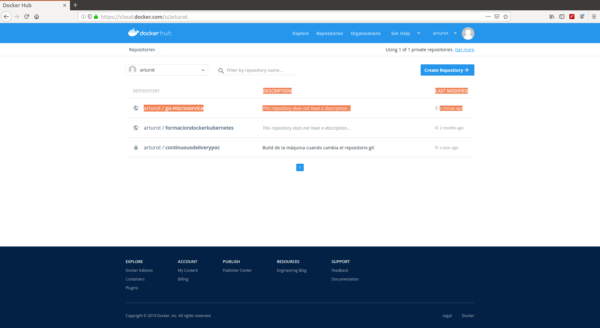
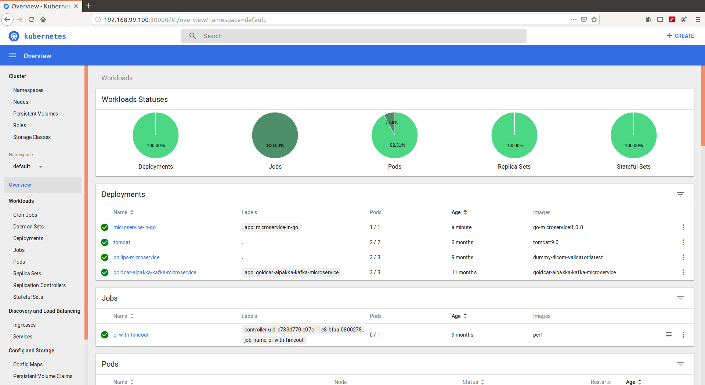

# Microservice implementation

#### Table Of Contents
1. [Document objective](#1-document-objective)
2. [Implemented endpoints](#2-implemented-endpoints)
3. [Containerizing the application with Docker](#3-containerizing-the-application-with-docker)
4. [Containerizing the application with Docker Compose](#4-containerizing-the-application-with-docker-compose)
5. [Pushing the Docker image to Docker Hub](#5-pushing-the-docker-image-to-docker-hub)
6. [Kubernetes orchestration](#6-kubernetes-orchestration)

## 1 Document objective

In this block we are going to use Golang and the Gin-Gonic framework to:
 
* Implement a basic HTTP microservice service with configurable port
* Implement a basic routing logic for different paths and verbs
* Implement JSON request and response processing
* Create Docker images based on these microservices
* Publish them into a Docker hub
* Run Docker containers
* Kubernetes orchestration of our containerized microservices

## 2 Implemented endpoints

We are importing the Gin Gonic framework to do so:

```
arturotarin@QOSMIO-X70B:~/go/src/github.com/ArturoTarinVillaescusa/go_cloud_orchestration/main
19:44:05 $ go get github.com/gin-gonic/gin
```

Then, we build our Gin server:
 
```
arturotarin@QOSMIO-X70B:~/go/src/github.com/ArturoTarinVillaescusa/go_cloud_orchestration/go_microservice_frameworks/microservice_implementation
07:04:42 $ go build

arturotarin@QOSMIO-X70B:~/go/src/github.com/ArturoTarinVillaescusa/go_cloud_orchestration/go_microservice_frameworks/microservice_implementation
07:08:30 $ ls -rlht
total 15M
-rw-rw-r-- 1 arturotarin arturotarin 1,8K jul 19 08:56 main.go
-rw-rw-r-- 1 arturotarin arturotarin 1,2K jul 19 08:56 cars.go
-rwxrwxr-x 1 arturotarin arturotarin  15M jul 19 09:00 microservice_implementation
-rw-rw-r-- 1 arturotarin arturotarin 2,6K jul 19 09:00 README.md

```
 
Execute the released binary in debug mode:

```
arturotarin@QOSMIO-X70B:~/go/src/github.com/ArturoTarinVillaescusa/go_cloud_orchestration/go_microservice_frameworks/microservice_implementation
07:09:13 $ ./microservice_implementation 
GIN-debug] [WARNING] Creating an Engine instance with the Logger and Recovery middleware already attached.

[GIN-debug] [WARNING] Running in "debug" mode. Switch to "release" mode in production.
 - using env:	export GIN_MODE=release
 - using code:	gin.SetMode(gin.ReleaseMode)

[GIN-debug] GET    /ping                     --> main.main.func1 (3 handlers)
[GIN-debug] GET    /hello                    --> main.main.func2 (3 handlers)
[GIN-debug] GET    /api/cars                 --> main.main.func3 (3 handlers)
[GIN-debug] POST   /api/cars                 --> main.main.func4 (3 handlers)
[GIN-debug] GET    /api/cars/:carid          --> main.main.func5 (3 handlers)
[GIN-debug] PUT    /api/cars/:carid          --> main.main.func6 (3 handlers)
[GIN-debug] DELETE /api/cars/:carid          --> main.main.func7 (3 handlers)
[GIN-debug] Listening and serving HTTP on :8080

```

Or execute it in release mode if you want to:

```
arturotarin@QOSMIO-X70B:~/go/src/github.com/ArturoTarinVillaescusa/go_cloud_orchestration/go_microservice_frameworks/microservice_implementation
07:03:30 $ export GIN_MODE=release

arturotarin@QOSMIO-X70B:~/go/src/github.com/ArturoTarinVillaescusa/go_cloud_orchestration/go_microservice_frameworks/microservice_implementation
07:03:36 $ ./microservice_implementation 
```

Then we can start sending requests to our Gin's /ping endpoint:

```
arturotarin@QOSMIO-X70B:~/go/src/github.com/ArturoTarinVillaescusa/go_cloud_orchestration/go_microservice_frameworks/microservice_implementation
06:50:40 $ curl localhost:8080/ping
pong
```

We can see how they're being logged in our Gin server:

```
arturotarin@QOSMIO-X70B:~/go/src/github.com/ArturoTarinVillaescusa/go_cloud_orchestration/go_microservice_frameworks/microservice_implementation
07:03:36 $ ./main 
[GIN] 2019/07/19 - 07:04:21 | 200 |      49.348µs |       127.0.0.1 | GET      /ping
```

Getting all the cars:

```
arturotarin@QOSMIO-X70B:~/go/src/github.com/ArturoTarinVillaescusa/go_cloud_orchestration/go_microservice_frameworks/microservice_implementation
08:45:14 $ curl localhost:8080/api/cars
[{"id":"0345391802","manufacturer":"Ford","model":"Galaxy"},{"id":"0000000000","manufacturer":"Porsche","model":"Carrera"}]
```

Adding a car and check the car has been added: 
```
arturotarin@QOSMIO-X70B:~/go/src/github.com/ArturoTarinVillaescusa/go_cloud_orchestration/go_microservice_frameworks/microservice_implementation
09:04:59 $ curl -d '{"id":"00001","manufacturer":"Renault","model":"4"}' -H "Content-Type: application/json" -X POST curl localhost:8080/api/cars

arturotarin@QOSMIO-X70B:~/go/src/github.com/ArturoTarinVillaescusa/go_cloud_orchestration/go_microservice_frameworks/microservice_implementation
09:07:44 $ curl localhost:8080/api/cars
[{"id":"0345391802","manufacturer":"Ford","model":"Galaxy"},{"id":"0000000000","manufacturer":"Porsche","model":"Carrera"},{"id":"00001","manufacturer":"Renault","model":"4"}]

arturotarin@QOSMIO-X70B:~/go/src/github.com/ArturoTarinVillaescusa/go_cloud_orchestration/go_microservice_frameworks/microservice_implementation
09:07:55 $ curl localhost:8080/api/cars/00001
{"id":"00001","manufacturer":"Renault","model":"4"}

```

Modifying a car:
```
arturotarin@QOSMIO-X70B:~/go/src/github.com/ArturoTarinVillaescusa/go_cloud_orchestration/go_microservice_frameworks/microservice_implementation
11:02:56 $ curl -d '{"id":"00001","manufacturer":"Renault","model":"6"}' -H "Content-Type: application/json" -X PUT curl localhost:8080/api/cars/00001

arturotarin@QOSMIO-X70B:~/go/src/github.com/ArturoTarinVillaescusa/go_cloud_orchestration/go_microservice_frameworks/microservice_implementation
11:03:32 $ curl localhost:8080/api/cars/00001
{"id":"00001","manufacturer":"Renault","model":"6"}
```

Deleting a car:
```
oservice_implementation
11:04:54 $ curl -X DELETE curl localhost:8080/api/cars/00001curl: (6) Could not resolve host: curl

arturotarin@QOSMIO-X70B:~/go/src/github.com/ArturoTarinVillaescusa/go_cloud_orchestration/go_microservice_frameworks/microservice_implementation
11:05:45 $ curl localhost:8080/api/cars/00001

arturotarin@QOSMIO-X70B:~/go/src/github.com/ArturoTarinVillaescusa/go_cloud_orchestration/go_microservice_frameworks/microservice_implementation
11:05:49 $ curl localhost:8080/api/cars
[{"id":"0345391802","manufacturer":"Ford","model":"Galaxy"},{"id":"0000000000","manufacturer":"Porsche","model":"Carrera"}]
```

## 3 Containerizing the application with Docker

Building and tagging the image

```
arturotarin@QOSMIO-X70B:~/go/src/github.com/ArturoTarinVillaescusa/go_cloud_orchestration/go_microservice_frameworks/microservice_implementation
11:44:35 $ docker build -t go-microservice:1.0.0 .
Sending build context to Docker daemon  15.65MB
Step 1/8 : FROM golang:1.12-alpine
1.12-alpine: Pulling from library/golang
050382585609: Pull complete 
0bb4ee3360d7: Pull complete 
893f09c2afb0: Pull complete 
db25f79b026e: Pull complete 
4387e72e4ead: Pull complete 
Digest: sha256:1121c345b1489bb5e8a9a65b612c8fed53c175ce72ac1c76cf12bbfc35211310
Status: Downloaded newer image for golang:1.12-alpine
 ---> 6b21b4c6e7a3
Step 2/8 : RUN apk update && apk upgrade && apk add --no-cache bash git &&     go get -u github.com/gin-gonic/gin
 ---> Running in 8a5ed72fc68a
fetch http://dl-cdn.alpinelinux.org/alpine/v3.10/main/x86_64/APKINDEX.tar.gz
fetch http://dl-cdn.alpinelinux.org/alpine/v3.10/community/x86_64/APKINDEX.tar.gz
v3.10.1-11-g89d0862481 [http://dl-cdn.alpinelinux.org/alpine/v3.10/main]
v3.10.1-9-gebc7b05d9e [http://dl-cdn.alpinelinux.org/alpine/v3.10/community]
OK: 10327 distinct packages available
OK: 6 MiB in 15 packages
fetch http://dl-cdn.alpinelinux.org/alpine/v3.10/main/x86_64/APKINDEX.tar.gz
fetch http://dl-cdn.alpinelinux.org/alpine/v3.10/community/x86_64/APKINDEX.tar.gz
(1/10) Installing ncurses-terminfo-base (6.1_p20190518-r0)
(2/10) Installing ncurses-terminfo (6.1_p20190518-r0)
(3/10) Installing ncurses-libs (6.1_p20190518-r0)
(4/10) Installing readline (8.0.0-r0)
(5/10) Installing bash (5.0.0-r0)
Executing bash-5.0.0-r0.post-install
(6/10) Installing nghttp2-libs (1.38.0-r0)
(7/10) Installing libcurl (7.65.1-r0)
(8/10) Installing expat (2.2.7-r0)
(9/10) Installing pcre2 (10.33-r0)
(10/10) Installing git (2.22.0-r0)
Executing busybox-1.30.1-r2.trigger
OK: 30 MiB in 25 packages
 ---> 752ce4079ad6
Removing intermediate container 8a5ed72fc68a
Step 3/8 : ENV SOURCES /go/src/github.com/ArturoTarinVillaescusa/go_cloud_orchestration/go_microservice_frameworks/microservice_implementation/
 ---> Running in 0acb7d5cdd18
 ---> 58bf1c51b655
Removing intermediate container 0acb7d5cdd18
Step 4/8 : COPY . ${SOURCES}
 ---> 0f7f499eade1
Removing intermediate container 4103d9ec0dca
Step 5/8 : RUN cd ${SOURCES} && CGO_ENABLED=0 go build
 ---> Running in b16c92a89a7f
 ---> 77e705be0ac2
Removing intermediate container b16c92a89a7f
Step 6/8 : WORKDIR ${SOURCES}
 ---> aac714ec0077
Removing intermediate container eebecc28bb4d
Step 7/8 : CMD ${SOURCES}microservice_implementation
 ---> Running in b080b0880f32
 ---> e14cd1edaabb
Removing intermediate container b080b0880f32
Step 8/8 : EXPOSE 8080
 ---> Running in 8229893c58fe
 ---> 7870aec6a444
Removing intermediate container 8229893c58fe
Successfully built 7870aec6a444
Successfully tagged go-microservice:1.0.0

arturotarin@QOSMIO-X70B:~/go/src/github.com/ArturoTarinVillaescusa/go_cloud_orchestration/go_microservice_frameworks/microservice_implementation
11:47:05 $ docker images
REPOSITORY          TAG                 IMAGE ID            CREATED              SIZE
go-microservice     1.0.0               7870aec6a444        About a minute ago   477MB
golang              1.12-alpine         6b21b4c6e7a3        7 days ago           350MB

```

Running a container based in our Docker image:

```
arturotarin@QOSMIO-X70B:~/go/src/github.com/ArturoTarinVillaescusa/go_cloud_orchestration/go_microservice_frameworks/microservice_implementation
11:51:56 $ docker run -d --name microservice-in-go go-microservice:1.0.0 
cf1db92e4c2cd04edbb413faa13df43f46456ee3bb8e8b298d262dc23215100c

arturotarin@QOSMIO-X70B:~/go/src/github.com/ArturoTarinVillaescusa/go_cloud_orchestration/go_microservice_frameworks/microservice_implementation
11:53:15 $ docker ps
CONTAINER ID        IMAGE                   COMMAND                  CREATED              STATUS              PORTS               NAMES
cf1db92e4c2c        go-microservice:1.0.0   "/bin/sh -c ${SOUR..."   About a minute ago   Up About a minute   8080/tcp            microservice-in-go

```

Looking at the container logs:

```
arturotarin@QOSMIO-X70B:~/go/src/github.com/ArturoTarinVillaescusa/go_cloud_orchestration/go_microservice_frameworks/microservice_implementation
11:55:08 $ docker logs  microservice-in-go --tail 100 -f
[GIN-debug] [WARNING] Creating an Engine instance with the Logger and Recovery middleware already attached.

[GIN-debug] [WARNING] Running in "debug" mode. Switch to "release" mode in production.
 - using env:	export GIN_MODE=release
 - using code:	gin.SetMode(gin.ReleaseMode)

[GIN-debug] GET    /ping                     --> main.main.func1 (3 handlers)
[GIN-debug] GET    /hello                    --> main.main.func2 (3 handlers)
[GIN-debug] GET    /api/cars                 --> main.main.func3 (3 handlers)
[GIN-debug] POST   /api/cars                 --> main.main.func4 (3 handlers)
[GIN-debug] Loaded HTML Templates (2): 
	- 
	- index.html

[GIN-debug] GET    /favicon.ico              --> github.com/gin-gonic/gin.(*RouterGroup).StaticFile.func1 (3 handlers)
[GIN-debug] HEAD   /favicon.ico              --> github.com/gin-gonic/gin.(*RouterGroup).StaticFile.func1 (3 handlers)
[GIN-debug] GET    /                         --> main.main.func5 (3 handlers)
[GIN-debug] GET    /api/cars/:carid          --> main.main.func6 (3 handlers)
[GIN-debug] PUT    /api/cars/:carid          --> main.main.func7 (3 handlers)
[GIN-debug] DELETE /api/cars/:carid          --> main.main.func8 (3 handlers)
[GIN-debug] Listening and serving HTTP on :8080

```

SSHing to the container:

```
arturotarin@QOSMIO-X70B:~/go/src/github.com/ArturoTarinVillaescusa/go_cloud_orchestration/go_microservice_frameworks/microservice_implementation
11:58:31 $ docker exec -it microservice-in-go bash
bash-5.0# 

bash-5.0# echo $GOLANG_VERSION 
1.12.7

bash-5.0# echo $GOPATH/
/go/

bash-5.0# ps -ef
PID   USER     TIME  COMMAND
    1 root      0:00 /go/src/github.com/ArturoTarinVillaescusa/go_cloud_orchestration/go_microservice_frameworks/microservice_implementation/microservice_implement
   12 root      0:00 bash
   23 root      0:00 ps -ef

```

Knowing the container ip:

```
arturotarin@QOSMIO-X70B:~/go/src/github.com/ArturoTarinVillaescusa/go_cloud_orchestration/go_microservice_frameworks/microservice_implementation
12:01:53 $ docker inspect microservice-in-go | grep "IPAddress"
            "IPAddress": "172.17.0.3",
```

Calling the microservice:

```
arturotarin@QOSMIO-X70B:~/go/src/github.com/ArturoTarinVillaescusa/go_cloud_orchestration/go_microservice_frameworks/microservice_implementation
12:02:06 $ curl 172.17.0.3:8080/api/cars
[{"id":"0345391802","manufacturer":"Ford","model":"Galaxy"},{"id":"0000000000","manufacturer":"Porsche","model":"Carrera"}]
```

Stopping and removing it all:
```
arturotarin@QOSMIO-X70B:~/go/src/github.com/ArturoTarinVillaescusa/go_cloud_orchestration/go_microservice_frameworks/microservice_implementation
12:03:25 $ docker ps
CONTAINER ID        IMAGE                   COMMAND                  CREATED             STATUS              PORTS               NAMES
cf1db92e4c2c        go-microservice:1.0.0   "/bin/sh -c ${SOUR..."   12 minutes ago      Up 12 minutes       8080/tcp            microservice-in-go

arturotarin@QOSMIO-X70B:~/go/src/github.com/ArturoTarinVillaescusa/go_cloud_orchestration/go_microservice_frameworks/microservice_implementation
12:04:58 $ docker rm -f cf1db92e4c2c
cf1db92e4c2c

arturotarin@QOSMIO-X70B:~/go/src/github.com/ArturoTarinVillaescusa/go_cloud_orchestration/go_microservice_frameworks/microservice_implementation
12:05:12 $ docker images
REPOSITORY          TAG                 IMAGE ID            CREATED             SIZE
go-microservice     1.0.0               7870aec6a444        18 minutes ago      477MB
golang              1.12-alpine         6b21b4c6e7a3        7 days ago          350MB

arturotarin@QOSMIO-X70B:~/go/src/github.com/ArturoTarinVillaescusa/go_cloud_orchestration/go_microservice_frameworks/microservice_implementation
12:05:15 $ docker rmi 7870aec6a444
Untagged: go-microservice:1.0.0
Deleted: sha256:7870aec6a44491acd7a279c4f4efd74958c2946eb37a5eae8fb1abaa0b52cb36
Deleted: sha256:e14cd1edaabb53924fbcfdc50816aaa18effdbd3adf4d7184d15d15b0945e718
Deleted: sha256:aac714ec0077c587a3802938972457ac5c56aba970edd6882dc8979e2039c1a9
Deleted: sha256:77e705be0ac285c49f636c62709c5ccc9dd9002f02ef9a296b25beb2db2950ee
Deleted: sha256:205d43464f530f2aef6f521f94ae5a0c1e594cfcd461d27ee8aed7b7d4fd1bc2
Deleted: sha256:0f7f499eade135f850b7a2c846ee3199de03aef3a120f847755d0b715f64172a
Deleted: sha256:6274aa25700050accd3505452b9b2dc1716eca0bbd57f49c6163d72c8577871d
Deleted: sha256:58bf1c51b65512eda48356325f61d9361ac9a14c39419e998673080f95b58774
Deleted: sha256:752ce4079ad66768fe26470bad60b05cece32aa86212b3592b2bcd9094aa67d3
Deleted: sha256:e4ea2e51ccfa7545f541efa3064d333892155fe54f38d5489ad9384ed23a7e62
```

## 4 Containerizing the application with Docker Compose

Building the docker-compose.yml file:

```
arturotarin@QOSMIO-X70B:~/go/src/github.com/ArturoTarinVillaescusa/go_cloud_orchestration/go_microservice_frameworks/microservice_implementation
12:09:54 $ docker-compose build
Building microservice-in-go
Step 1/8 : FROM golang:1.12-alpine
1.12-alpine: Pulling from library/golang
050382585609: Pull complete
0bb4ee3360d7: Pull complete
893f09c2afb0: Pull complete
db25f79b026e: Pull complete
4387e72e4ead: Pull complete
Digest: sha256:1121c345b1489bb5e8a9a65b612c8fed53c175ce72ac1c76cf12bbfc35211310
Status: Downloaded newer image for golang:1.12-alpine
 ---> 6b21b4c6e7a3
Step 2/8 : RUN apk update && apk upgrade && apk add --no-cache bash git &&     go get -u github.com/gin-gonic/gin
 ---> Running in a0616bba6de5
fetch http://dl-cdn.alpinelinux.org/alpine/v3.10/main/x86_64/APKINDEX.tar.gz
fetch http://dl-cdn.alpinelinux.org/alpine/v3.10/community/x86_64/APKINDEX.tar.gz
v3.10.1-11-g89d0862481 [http://dl-cdn.alpinelinux.org/alpine/v3.10/main]
v3.10.1-9-gebc7b05d9e [http://dl-cdn.alpinelinux.org/alpine/v3.10/community]
OK: 10327 distinct packages available
OK: 6 MiB in 15 packages
fetch http://dl-cdn.alpinelinux.org/alpine/v3.10/main/x86_64/APKINDEX.tar.gz
fetch http://dl-cdn.alpinelinux.org/alpine/v3.10/community/x86_64/APKINDEX.tar.gz
(1/10) Installing ncurses-terminfo-base (6.1_p20190518-r0)
(2/10) Installing ncurses-terminfo (6.1_p20190518-r0)
(3/10) Installing ncurses-libs (6.1_p20190518-r0)
(4/10) Installing readline (8.0.0-r0)
(5/10) Installing bash (5.0.0-r0)
Executing bash-5.0.0-r0.post-install
(6/10) Installing nghttp2-libs (1.38.0-r0)
(7/10) Installing libcurl (7.65.1-r0)
(8/10) Installing expat (2.2.7-r0)
(9/10) Installing pcre2 (10.33-r0)
(10/10) Installing git (2.22.0-r0)
Executing busybox-1.30.1-r2.trigger
OK: 30 MiB in 25 packages
 ---> fbe814ec2773
Removing intermediate container a0616bba6de5
Step 3/8 : ENV SOURCES /go/src/github.com/ArturoTarinVillaescusa/go_cloud_orchestration/go_microservice_frameworks/microservice_implementation/
 ---> Running in ed8122f2894c
 ---> ba43cacfe5e5
Removing intermediate container ed8122f2894c
Step 4/8 : COPY . ${SOURCES}
 ---> 3aa558a253d7
Removing intermediate container a275ae837600
Step 5/8 : RUN cd ${SOURCES} && CGO_ENABLED=0 go build
 ---> Running in 15dfa337c93c
 ---> 3b8bcb09ee38
Removing intermediate container 15dfa337c93c
Step 6/8 : WORKDIR ${SOURCES}
 ---> 6efda4b5dec4
Removing intermediate container 9886e657a219
Step 7/8 : CMD ${SOURCES}microservice_implementation
 ---> Running in e2911828c9bb
 ---> 77aa7ba4b918
Removing intermediate container e2911828c9bb
Step 8/8 : EXPOSE 8080
 ---> Running in 3681d2ecf269
 ---> d47bd5746538
Removing intermediate container 3681d2ecf269
Successfully built d47bd5746538
Successfully tagged go-microservice:1.0.1

arturotarin@QOSMIO-X70B:~/go/src/github.com/ArturoTarinVillaescusa/go_cloud_orchestration/go_microservice_frameworks/microservice_implementation
12:16:17 $ docker images
REPOSITORY          TAG                 IMAGE ID            CREATED             SIZE
go-microservice     1.0.1               d47bd5746538        4 minutes ago       477MB
golang              1.12-alpine         6b21b4c6e7a3        7 days ago          350MB
```

Running the container:

```
arturotarin@QOSMIO-X70B:~/go/src/github.com/ArturoTarinVillaescusa/go_cloud_orchestration/go_microservice_frameworks/microservice_implementation
12:16:27 $ docker-compose up -d microservice-in-go
Creating network "microserviceimplementation_default" with the default driver
Creating microserviceimplementation_microservice-in-go_1 ... done

arturotarin@QOSMIO-X70B:~/go/src/github.com/ArturoTarinVillaescusa/go_cloud_orchestration/go_microservice_frameworks/microservice_implementation
12:21:31 $ docker-compose ps
                     Name                                    Command               State           Ports         
-----------------------------------------------------------------------------------------------------------------
microserviceimplementation_microservice-in-go_1   /bin/sh -c ${SOURCES}micro ...   Up      0.0.0.0:8080->8080/tcp
```

Viewing the container logs:

```
arturotarin@QOSMIO-X70B:~/go/src/github.com/ArturoTarinVillaescusa/go_cloud_orchestration/go_microservice_frameworks/microservice_implementation
12:22:29 $ docker-compose logs microservice-in-go 
Attaching to microserviceimplementation_microservice-in-go_1
microservice-in-go_1  | [GIN-debug] [WARNING] Creating an Engine instance with the Logger and Recovery middleware already attached.
microservice-in-go_1  | 
microservice-in-go_1  | [GIN-debug] [WARNING] Running in "debug" mode. Switch to "release" mode in production.
microservice-in-go_1  |  - using env:	export GIN_MODE=release
microservice-in-go_1  |  - using code:	gin.SetMode(gin.ReleaseMode)
microservice-in-go_1  | 
microservice-in-go_1  | [GIN-debug] GET    /ping                     --> main.main.func1 (3 handlers)
microservice-in-go_1  | [GIN-debug] GET    /hello                    --> main.main.func2 (3 handlers)
microservice-in-go_1  | [GIN-debug] GET    /api/cars                 --> main.main.func3 (3 handlers)
microservice-in-go_1  | [GIN-debug] POST   /api/cars                 --> main.main.func4 (3 handlers)
microservice-in-go_1  | [GIN-debug] Loaded HTML Templates (2): 
microservice-in-go_1  | 	- 
microservice-in-go_1  | 	- index.html
microservice-in-go_1  | 
microservice-in-go_1  | [GIN-debug] GET    /favicon.ico              --> github.com/gin-gonic/gin.(*RouterGroup).StaticFile.func1 (3 handlers)
microservice-in-go_1  | [GIN-debug] HEAD   /favicon.ico              --> github.com/gin-gonic/gin.(*RouterGroup).StaticFile.func1 (3 handlers)
microservice-in-go_1  | [GIN-debug] GET    /                         --> main.main.func5 (3 handlers)
microservice-in-go_1  | [GIN-debug] GET    /api/cars/:carid          --> main.main.func6 (3 handlers)
microservice-in-go_1  | [GIN-debug] PUT    /api/cars/:carid          --> main.main.func7 (3 handlers)
microservice-in-go_1  | [GIN-debug] DELETE /api/cars/:carid          --> main.main.func8 (3 handlers)
microservice-in-go_1  | [GIN-debug] Listening and serving HTTP on :8080
```

As we have exposed the Docker port 8080 to our localhost, we can still use the same application urls as before.

Deleting everything:

```
arturotarin@QOSMIO-X70B:~/go/src/github.com/ArturoTarinVillaescusa/go_cloud_orchestration/go_microservice_frameworks/microservice_implementation
12:27:54 $ docker-compose stop
Stopping microserviceimplementation_microservice-in-go_1 ... done

arturotarin@QOSMIO-X70B:~/go/src/github.com/ArturoTarinVillaescusa/go_cloud_orchestration/go_microservice_frameworks/microservice_implementation
12:28:02 $ docker-compose rm
Going to remove microserviceimplementation_microservice-in-go_1
Are you sure? [yN] y
Removing microserviceimplementation_microservice-in-go_1 ... done
```

## 5 Pushing the Docker image to Docker Hub

Tagging the image:

```
arturotarin@QOSMIO-X70B:~/go/src/github.com/ArturoTarinVillaescusa/go_cloud_orchestration/go_microservice_frameworks/microservice_implementation
12:35:56 $ docker images
REPOSITORY          TAG                 IMAGE ID            CREATED             SIZE
go-microservice     1.0.1               d47bd5746538        23 minutes ago      477MB
golang              1.12-alpine         6b21b4c6e7a3        7 days ago          350MB

arturotarin@QOSMIO-X70B:~/go/src/github.com/ArturoTarinVillaescusa/go_cloud_orchestration/go_microservice_frameworks/microservice_implementation
12:35:58 $ docker tag go-microservice:1.0.1 arturot/go-microservice:1.0.1

arturotarin@QOSMIO-X70B:~/go/src/github.com/ArturoTarinVillaescusa/go_cloud_orchestration/go_microservice_frameworks/microservice_implementation
12:36:35 $ docker images
REPOSITORY                TAG                 IMAGE ID            CREATED             SIZE
go-microservice           1.0.1               d47bd5746538        24 minutes ago      477MB
arturot/go-microservice   1.0.1               d47bd5746538        24 minutes ago      477MB
golang                    1.12-alpine         6b21b4c6e7a3        7 days ago          350MB
```

Pushing the image to my Docker Hub account:

```
arturotarin@QOSMIO-X70B:~/go/src/github.com/ArturoTarinVillaescusa/go_cloud_orchestration/go_microservice_frameworks/microservice_implementation
12:36:37 $ docker push arturot/go-microservice
The push refers to a repository [docker.io/arturot/go-microservice]
2a768907face: Pushed 
7fa4dd082742: Pushed 
5f1968c1ed81: Pushed 
95f148bce382: Mounted from library/golang 
58de2ae4cd62: Mounted from library/golang 
e0a42524f665: Mounted from library/golang 
05540d8bb3fd: Mounted from library/golang 
1bfeebd65323: Mounted from library/golang 
1.0.1: digest: sha256:6a44e7dedc8c9fc462de739d4e971232d0186a37512ba2d9edf3d15cae33b031 size: 2000
```

The image has been uploaded to my Docker Hub account, arturot:





## 6 Kubernetes orchestration

We are going to deploy our Docker container images into a local Kubernetes. For that we have prepared these files:

```
arturotarin@QOSMIO-X70B:~/go/src/github.com/ArturoTarinVillaescusa/go_cloud_orchestration/go_microservice_frameworks/microservice_implementation
13:23:42 $ ls -rlht kubernetes/
total 12K
-rw-rw-r-- 1 arturotarin arturotarin 1,2K jul 19 13:03 k8s-deployment.yml
-rw-rw-r-- 1 arturotarin arturotarin  223 jul 19 13:03 k8s-ingress.yml
-rw-rw-r-- 1 arturotarin arturotarin  284 jul 19 13:03 k8s-service.yml
```

Start Minikube and check our ip:

```
arturotarin@QOSMIO-X70B:~/go/src/github.com/ArturoTarinVillaescusa/go_cloud_orchestration/go_microservice_frameworks/microservice_implementation
13:04:57 $ minikube start
Starting local Kubernetes v1.10.0 cluster...
Starting VM...
Getting VM IP address...
Moving files into cluster...
Setting up certs...
Connecting to cluster...
Setting up kubeconfig...
Starting cluster components...
Kubectl is now configured to use the cluster.
Loading cached images from config file.

arturotarin@QOSMIO-X70B:~/go/src/github.com/ArturoTarinVillaescusa/go_cloud_orchestration/go_microservice_frameworks/microservice_implementation
13:06:28 $ minikube ip
192.168.99.100

arturotarin@QOSMIO-X70B:~/go/src/github.com/ArturoTarinVillaescusa/go_cloud_orchestration/go_microservice_frameworks/microservice_implementation
13:06:48 $ kubectl cluster-info
Kubernetes master is running at https://192.168.99.100:8443
KubeDNS is running at https://192.168.99.100:8443/api/v1/namespaces/kube-system/services/kube-dns:dns/proxy

To further debug and diagnose cluster problems, use 'kubectl cluster-info dump'.
```

See the Minikube Docker environment:

```
arturotarin@QOSMIO-X70B:~/go/src/github.com/ArturoTarinVillaescusa/go_cloud_orchestration/go_microservice_frameworks/microservice_implementation
13:08:40 $ minikube docker-env
export DOCKER_TLS_VERIFY="1"
export DOCKER_HOST="tcp://192.168.99.100:2376"
export DOCKER_CERT_PATH="/home/arturotarin/.minikube/certs"
export DOCKER_API_VERSION="1.35"
# Run this command to configure your shell:
# eval $(minikube docker-env)
```

Load Minikube Docker environment credentials:

```
arturotarin@QOSMIO-X70B:~/go/src/github.com/ArturoTarinVillaescusa/go_cloud_orchestration/go_microservice_frameworks/microservice_implementation
13:08:28 $ eval $(minikube docker-env)
```

Build the Docker image in the Minikube Docker environment:
```
arturotarin@QOSMIO-X70B:~/go/src/github.com/ArturoTarinVillaescusa/go_cloud_orchestration/go_microservice_frameworks/microservice_implementation
13:32:54 $ docker build -t go-microservice:1.0.0 .
```

Deploy the application in Kubernetes:
```
arturotarin@QOSMIO-X70B:~/go/src/github.com/ArturoTarinVillaescusa/go_cloud_orchestration/go_microservice_frameworks/microservice_implementation
13:25:18 $ kubectl apply -f kubernetes/
deployment "microservice-in-go" created
ingress "microservice-in-go" created
service "microservice-in-go" created
```

List my deployments from the command line:

```
arturotarin@QOSMIO-X70B:~/go/src/github.com/ArturoTarinVillaescusa/go_cloud_orchestration/go_microservice_frameworks/microservice_implementation
13:27:39 $ kubectl get deployments
NAME                                 DESIRED   CURRENT   UP-TO-DATE   AVAILABLE   AGE
goldcar-alpakka-kafka-microservice   3         3         3            3           331d
microservice-in-go                   3         3         3            0           2m
philips-microservice                 3         3         3            3           291d
tomcat                               2         2         2            2           90d
```

List of the pods running:

```
arturotarin@QOSMIO-X70B:~/go/src/github.com/ArturoTarinVillaescusa/go_cloud_orchestration/go_microservice_frameworks/microservice_implementation
13:37:55 $ kubectl get pods
NAME                                                 READY     STATUS    RESTARTS   AGE
goldcar-alpakka-kafka-microservice-dc8dbcb9f-2sxw2   1/1       Running   9          331d
goldcar-alpakka-kafka-microservice-dc8dbcb9f-bqz9d   1/1       Running   9          331d
goldcar-alpakka-kafka-microservice-dc8dbcb9f-mhf2d   1/1       Running   9          331d
kafka-0                                              1/1       Running   14         297d
microservice-in-go-54d84cb66d-rchwj                  1/1       Running   0          13s
philips-microservice-6568ccdbd5-7b9cn                1/1       Running   2          291d
philips-microservice-6568ccdbd5-ckrsq                1/1       Running   2          291d
philips-microservice-6568ccdbd5-ff2bf                1/1       Running   2          291d
task-pv-pod                                          1/1       Running   4          292d
tomcat-56ff5c79c5-lf8fl                              1/1       Running   1          90d
tomcat-56ff5c79c5-znl24                              1/1       Running   1          90d
zk-0                                                 1/1       Running   10         331d
```


Open Minikube UI:

```
arturotarin@QOSMIO-X70B:~/go/src/github.com/ArturoTarinVillaescusa/go_cloud_orchestration/go_microservice_frameworks/microservice_implementation
13:12:31 $ minikube dashboard
Opening kubernetes dashboard in default browser...
```



 